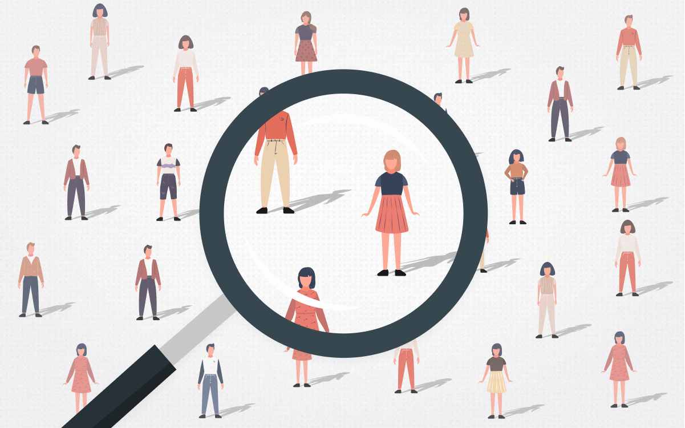
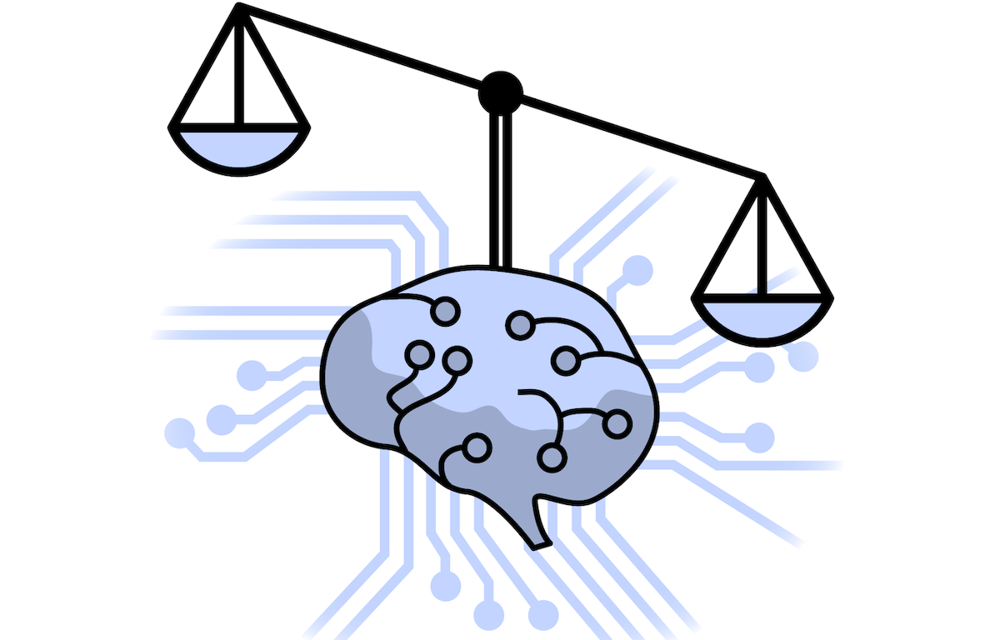

AI is in our day to day lives from recommendation systems when we get videos recommended on YouTube to voice assistants, facial recognition and autonomous vehicles. Ensuring AI follows ethical principles can make sure we can build AI systems that we trust.

## Human-Centered Design

Human-centered design is essentially designing systems that meet the demands of people. Before you want to create something with AI, you must first understand the people’s needs so you know what problem you want to solve. Then you must see if there is any value in adding AI to your potential solution. Look into the negative sides of the AI system in your solution and see if the positive impacts outweigh the negative. For example if your AI system is made to flag suspicious activity, if there is a high risk of blocking legitimate transactions, it is best to avoid this method. If AI is the best way to implement your solution, you can start prototyping first starting off with a non-AI prototype of your AI system, to see how people will first interact with it. This is so you can create your AI model according to how users will use your prototype which could be an app, website, etc. It is much more efficient to improve the prototype early on, then to redo the AI model and change the prototype completely. Consider safety measures with your system, like trying to protect your system if a person is trying to manipulate the system to do something unintended. For example, how many of you have tried to manipulate the voice assistants on your phones? Therefore it is important to take safety into consideration such as privacy and ways for users to let the developers know about potential safety issues with the AI system. In the case of autonomous cars, it is important to see if the car can drive itself even if people tried to manipulate the driving system. It is also important to test the safety features of the vehicles and test them in a variety of environments. All in all, human-centered design is something to consider when designing something that helps people to see if it really does help them and meets their needs.

## Bias

Despite machine learning having a huge potential to improve lives it can also cause harm. There have been many cases where AI systems have discriminated against individuals based on race, sex, religion, socioeconomic status and various other categories. Bias is an unwanted negative consequence of AI applications especially if they negatively impact certain groups. For example if there is a chatbot trained with a dataset from online conversations and some online conversations have racist comments, it is likely the chatbot will reflect aspects from the dataset it was trained on and will be racist at times.

**Historical bias** is when the data is generated during a point of time where there is a flaw in the state of the world.
**Representation bias** is when datasets used to train the model poorly represent the group that the model is supposed to help.
**Measurement bias** is when the data has not been accurately measured and it varies across different groups. For example when making a model to identify high risk patients at a hospital using medical costs, so the higher medical costs are more common to correspond to high risk patients as they would have to spend more and get more treatments. But this has measurement bias as it does not account for race and Black patients experience more barriers to health care, they have less trust in the medical system as a result their medical costs would be significantly less compared to non-Black people who have the same conditions
**Aggregation bias** is when groups in a dataset are inappropriately combined which causes the model to perform well for the majority of the group or no group at all.
**Evaluation bias** happens when the model is being evaluated and it's when a benchmark dataset (standard dataset) is used to compare models that do similar tasks and this data does not represent the population it will help.
**Deployment bias** is when the users use the model differently from what it is actually intended for, which means that the model cannot serve its purpose.

When evaluating your model, don’t just look for one bias, there can be multiple biases overlapping as well. Try to minimize as much bias as possible.

## Fairness

It is important that the AI application is fair when making its decisions as it has the potential to treat groups of your population unfairly due to how it was trained. For example making a model that approves loans, it should be fair across all genders and ethnicities, no gender and ethnicity should have a higher advantage over the other. When looking at model fairness it is important for the model to be trained on data with a demographic of people that is proportional to the composition of the actual population. Everyone should have equal opportunity where the proportion of individuals that are selected by the model are the same for each group of individuals. The model should also have equal accuracy among all the groups, for example if the model is 95% accurate for males it should also be 95% accurate for females. We could also make the model be fair without having these groups, so it is fair through unawareness, this is called group unawareness. To analyze AI fairness, a confusion matrix is something worth looking into, it helps project the true positive, true negative, false positive and false negative values. Using a confusion matrix, we could see how the model is doing against different groups and if it is fair.

## Closing Remarks

When coming up with an effective machine learning model it is important to consider AI ethics so it can benefit the population you are trying to help the most. It is important to use human-centered design as the model you are building should actually help the population and serve their needs. Bias is something else to look into as no group should be marginalized based on flaws with your data and model, and it is important for the model to have as less bias as possible. The machine learning model should be fair so it serves as a model that helps individuals. Overall, AI ethics are important when making well performing models that are going to be making an impact over a large group of individuals.
