## Overview

CNN is a type of neural network model, which takes the raw pixel data, trains the model, and then extracts features for a better classification. From image and video recognition to natural language processing, many usages for CNNs are prevalent.

## Edge Detection

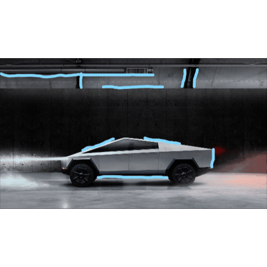

First off, notice that where there are edges, there are differences in light intensities between the truck/objects and the background. In order to detect these edges and in turn detect meaningful changes in the properties of the image, we need to use filters or kernels. As shown in the image, the filters can be at any angle (horizontal, vertical, 45 degree, etc), but for demonstration purposes, we are only going to be considering a vertical edge detection using the filter matrix shown below.

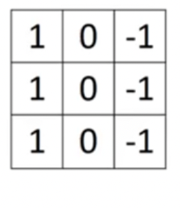

On the first iteration, the filter scans a gray scale image represented by its light intensity in a 6x6 matrix from columns 1 to 3 and rows 1 to 3, shifting by 3x3 elements on every iteration.

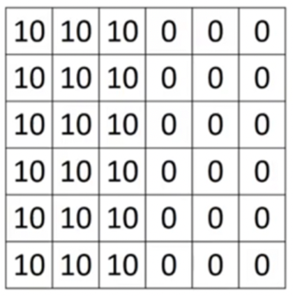

Thus, on the next iteration, the filter scans the matrix above from columns 2 to 4 and rows 1 to 3, and so on. The result is the 4x4 matrix on the right of the image below with a lighter region in the middle that corresponds with the vertical edge detected in the 6x6 image. 

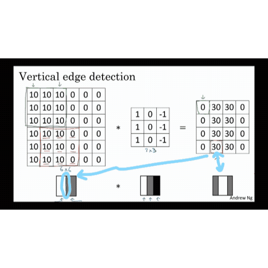

We can determine that the output matrix will have (n - f + 1) x (n - f + 1) elements if the input matrix has nxn elements and the filter has fxf elements using the process of **cross-correlation**. 

### Padding

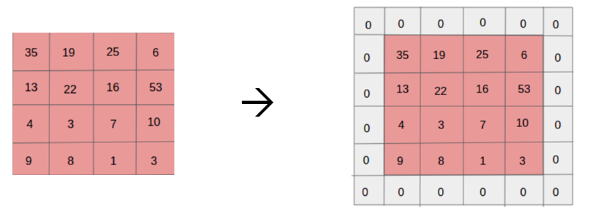

Accounting for smaller images as well as the loss of information in the corners of an input matrix, we will need to pad the image. We can determine that the output matrix will have
(n + 2p - f + 1) x (n + 2p - f + 1) elements if the input matrix has nxn elements, the filter has fxf elements, and the padding is p.

### Striding
Skipping an iteration instead of making the filter scan the input matrix continuously would mean setting the stride to 2 instead of 1. Hence, this would be useful when the image is large. Combining all these elements, the output matrix would be as follows.

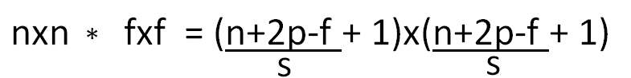

### Convolutions over Volume
Single Filter: The number of channels should be the same for both the filter and input matrix, following the dimensions of h x w x c (no of channels). Therefore, the output matrix will always have one channel.

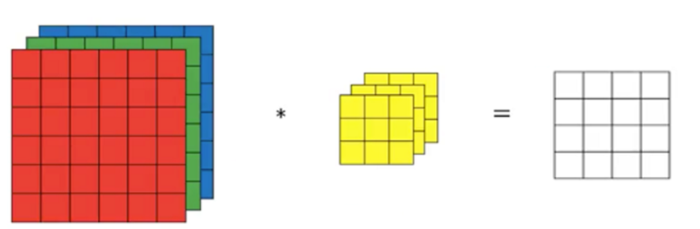

Multiple Filters: Although the number of channels will all be the same for the filters and the input matrix, there are multiple filters being used, so the output matrix will have the same number of channels as the number of filters used.

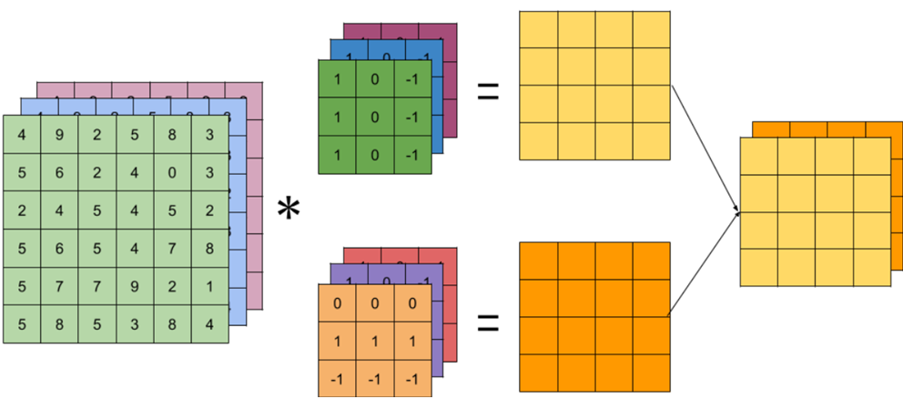

### Building a CNN Model
One layer of CNN model is defined as the computation from the input layer to the output layer using filter(s). Weights are parameters within a neural network that transform input data within the network’s hidden layers and control how much influence the input will have on the output, and a 3x3 filter has 10 parameters with 9 weights and 1 bias term, additional input into the next layer that ensures inputs with zeroes will still activate an output. Moreover, in contrast with traditional ANN models, CNN models are preferred as there is no correlation between the number of parameters and the size of the input.

Input matrix: n(h) x n(w) x n(c)
Filter: f x f x n(c); number of filters = n(c)’
Number of weights: [n(h) x n(w) + 1] x n(c)’

### Pooling Layer
Pooling layers help reduce the size of the feature maps by combining the outputs of one layer into a single neuron in the next layer, thereby also reducing the time of computation. Another important fact is that pooling layers do not have parameters that are derived during training or, in other words, only consist of hyperparameters. From the values that appear within the filter, which is one hyperparameter, max pooling will select the largest value while average pooling will average the values. 

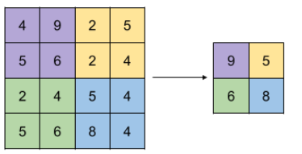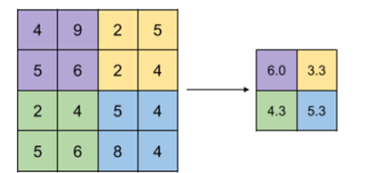

## Fully Connected Layer
Each unit of a fully connected layer is connected to a unit of the previous input layer. Through a weights matrix, the neuron applies a linear transformation to the input matrix. Then, a nonlinear function is applied to the product.

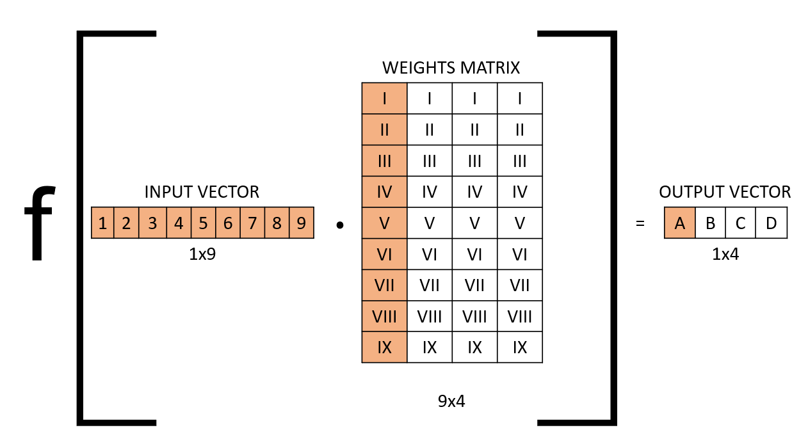
