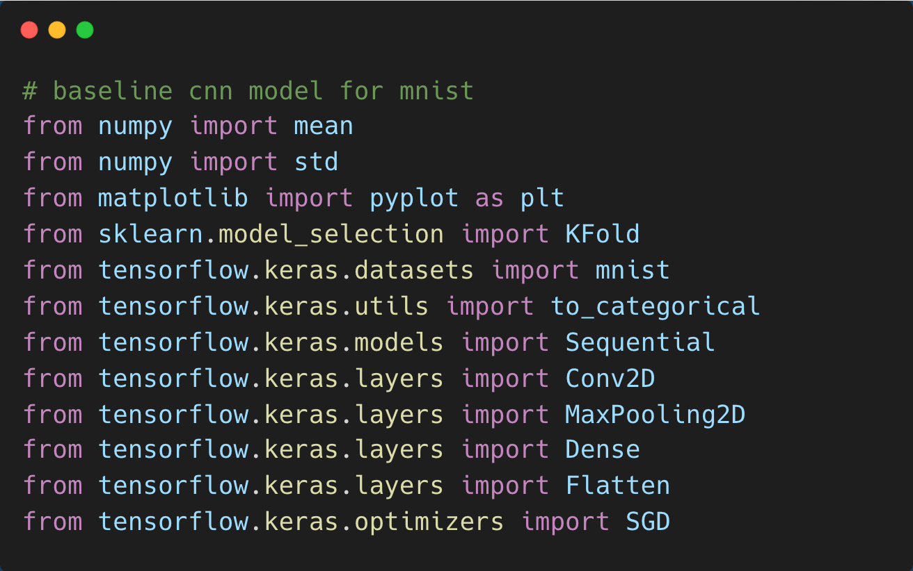
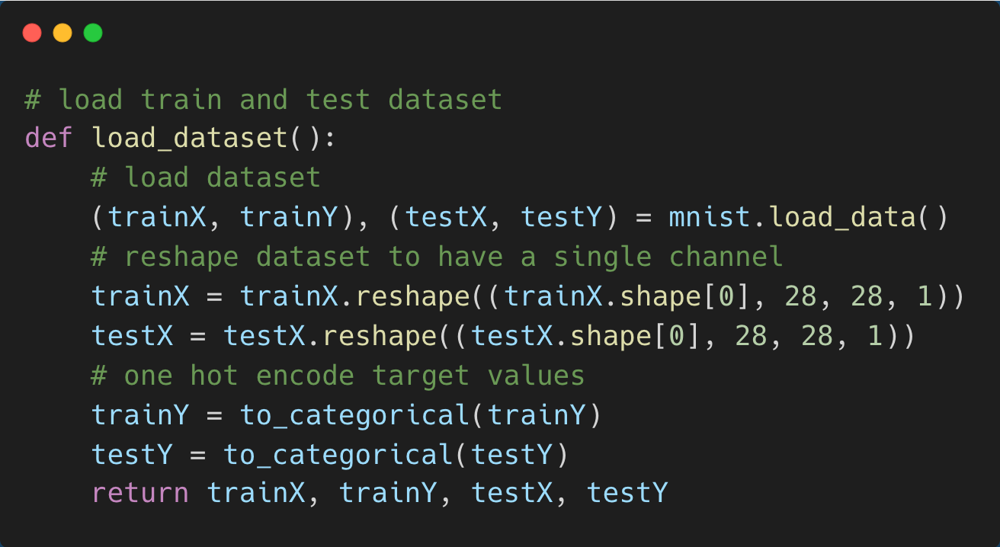
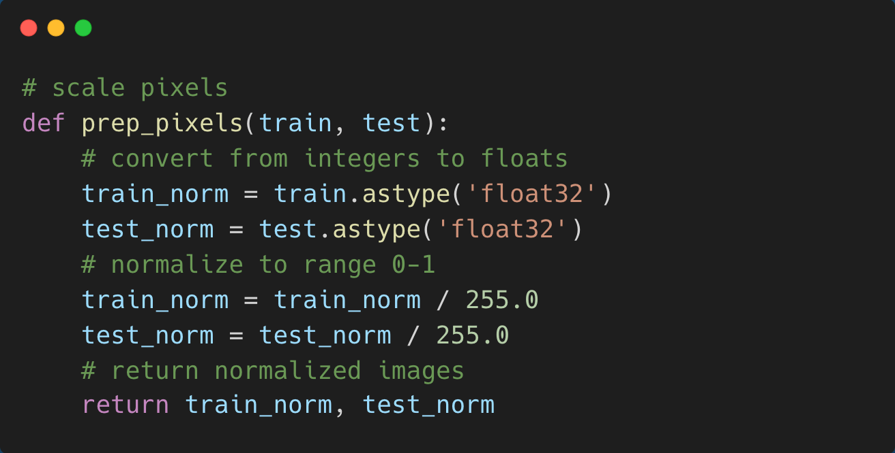
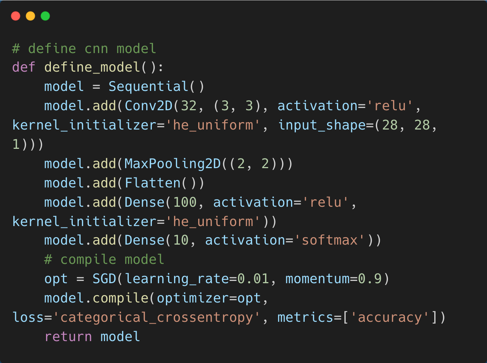
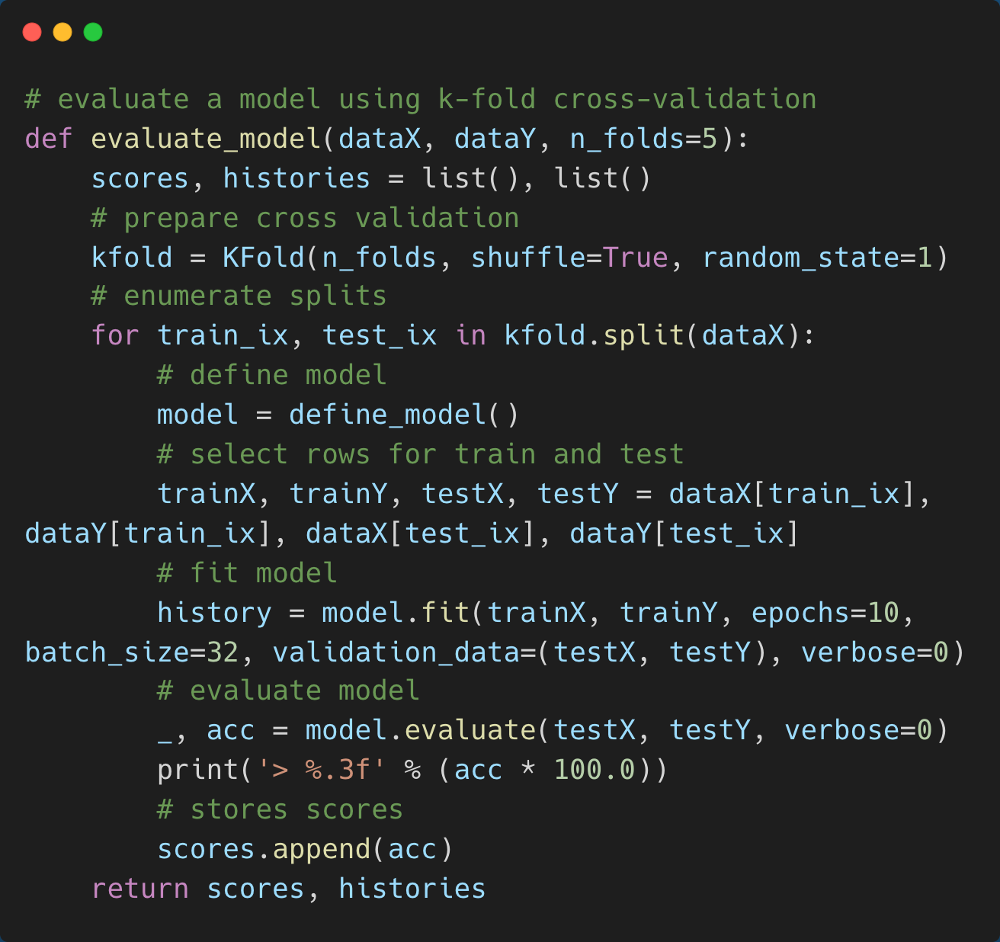
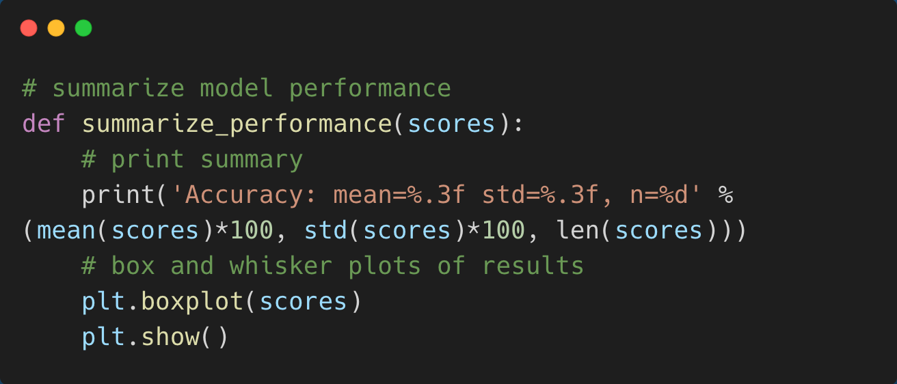
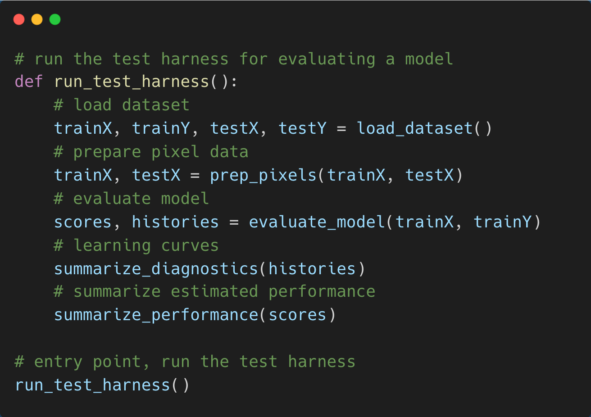

## Implementation Using MNIST Database
The [MNIST database](https://www.kaggle.com/c/digit-recognizer/data) contains multiple images of handwritten digits and is commonly used to train various image processing systems. The goal is to properly classify the digit that is written.
1. Import all needed libraries

2. Load train input and output datasets along with test input and output datasets
  First, split the MNIST database to training and testing datasets. Images in MNIST are all 28x28 pixels, contain only one hand drawn digit, and are grayscale, so we are able to reshape the training dataset to have only a single color channel. In addition, we know that there are 10 classes where each class is a unique integer from 0-9. Thus, we can transform the dataset using one-hot encoding to a 10 element binary array with 1 at the index of the integer and 0 for all other indices.
  

3. Normalize pixels of the datasets
  Since we don’t know the best way to scale the pixel values for the CNN model yet, we can start by normalizing the pixel values of grayscale images in the range [0, 255] (integers) to the range [0, 1]. To do this, first convert the unsigned integer to floats and then divide by the maximum value of 255.
  

4. Create the CNN model
  The model has two major parts: feature extraction front end and a prediction classifier back end. For the front end, we should use 32 filters of size 3x3 for the single convolutional layer. Then, let’s add a max pooling layer of size 2x2 and flatten the filter maps to provide the necessary features for the classifier. For the 10 different classes, we need to use 10 nodes that require the use of the softmax activation function. Between the feature extractor and output layer, we can add a dense layer of 100 nodes to interpret the features. We need to use a stochastic gradient descent optimizer with a learning rate of 1% and a momentum of 90%. This results in the optimization of the categorical cross-entropy loss function while monitoring the classification accuracy metric since we have the same number of examples in each class.
  

5. Evaluate the model
  Using five-fold cross-validation, we can evaluate our model. Each test set is 20% of the training dataset. We can train the model for 10 epochs with a batch size of 32 images. During each fold, the test set will be run to evaluate the model for the later classification accuracy of each fold.
  

6. Summarize model performance
  During each fold, the accuracies were stored in the scores vector. As a result, we can calculate the statistics, including standard deviation and means, from the vector. We can also produce a whisker/box plot of the results.
  

7. Putting it all together
  
  
The accuracy of the model should be about 98.6%.
