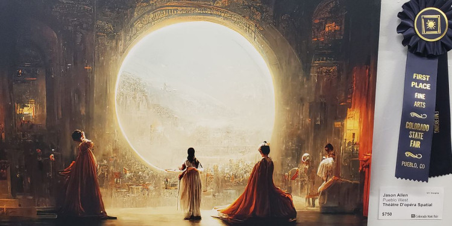
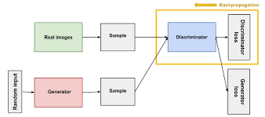
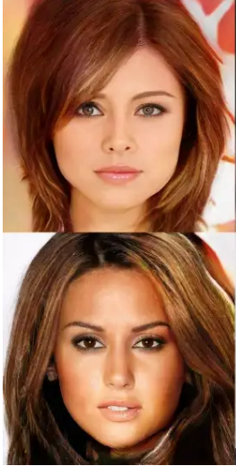
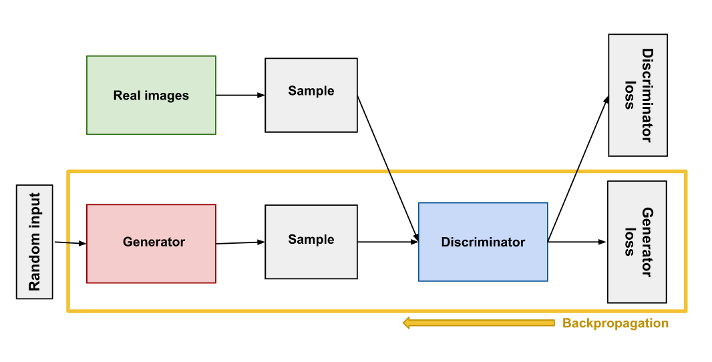
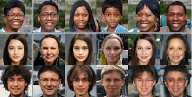

## Introduction

Recently, you may have heard the craze around AI Art. Just a few months ago, an AI won an art competition against a bunch of humans. It truly is fascinating. The Art that the AI generated looks frighteningly similar to that of what a human would draw. The AI took in a simple command of what the drawing should look like and outputted it in seconds. 

 
This image was created by an AI, and it won first place in the Colorado State Art Fair

But how is this all possible? Well, it is all thanks to a type of neural network that we call GANs. GANs stands for General Adversarial Networks. It is often used by AI to generate content, such as images and audio. In this article, we will dive into what GANs are and how they work. 

## How do GANs Work? 
GANs are made up of two parts: A discriminator and a generator. The generator is in charge of actually creating new products. The discriminator is in charge of differentiating between the generated product and a true product. So to sum up: the generator creates products such as images that the discriminator has to distinguish between a generated product or a true product. 
	

## In Depth: The Discriminator
The discriminator must be trained from two different sources: true data and fake data. The true data is from the real world such as real life images of a flower. It must also be given fake data generated by the generator. 

The top image is the fake data and the bottom image is the true data
 
Discriminators use two different loss functions during training. During the training session, the discriminator only focuses on its own loss value rather than the generator’s. The generator’s loss is typically used for the generator’s training. 

The discriminator takes its results on how well it classifies fake and real products, and uses backpropagation to adjust weights and biases accordingly. 

## In Depth: The Generator

Essentially, the generator tries to trick the discriminator. Its job is to create fake data that the discriminator uses. The generator first takes in random input and transforms it into random data using a generator network. After the discriminator tries to predict whether the product is real or fake, it returns its prediction to the generator who adjusts itself based on what the discriminator picked. 

## Overall Training
Due to the fact that GANs are made up of 2 neural networks, it is kind of hard to identify the impacts of the two networks as a whole. The two networks also take turns while training. The discriminator trains for a certain number of epochs and then the generator does the same for a certain number of epochs. As time goes on, the discriminator’s accuracy worsens due to the generator getting better and better at creating new images. 

To see a code sample of GANs with Google’s Tensorflow, check out [this notebook](https://colab.research.google.com/github/tensorflow/gan/blob/master/tensorflow_gan/examples/colab_notebooks/tfgan_tutorial.ipynb?utm_source=ss-gan&utm_campaign=colab-external&utm_medium=referral&utm_content=tfgan-intro)

## In Conclusion
GANs are a revolutionary part of AI that is starting to become more and more popular. It can generate all sorts of content from images, audio, to even emojis! GANs are made of 2 parts: the discriminator and the generator. The generator is responsible for creating the data and the discriminator is in charge of deciding how good the generated data is. These two neural networks work together to create a Machine Learning model that can generate content that is indistinguishable from real life. 

