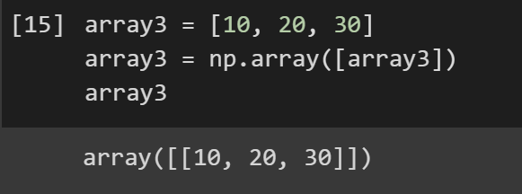

This Article Assumes Basic Python Knowledge.

Link to code can be found [here](https://colab.research.google.com/drive/1r4d9o_dzsfhBsP4EPcgDApN_IO9wEVXv#scrollTo=nMWpMvLWr_26)


## Introduction

We all know that numbers are fundamental in data science and machine learning. However, oftentimes in data science, our numbers aren’t always constants such as 1 or 2. We have to deal with numbers that are in multi-dimensional arrays. We don’t want to process these multi-dimensional numbers with pure Python. Wouldn’t it be nice if there was a Python library that allowed us to process these arrays and even provided some useful mathematical functions to manipulate them? Luckily, we have an amazing library called Numpy.


## Getting started
To get started, we first need to install all the necessary Python libraries. These are going to be Pandas for data manipulation and Numpy for processing multi-dimensional arrays. Run the following code in Jupyter Notebooks to install. 

```
!pip install pandas
!pip install numpy
```

Now that that’s done, let's import the libraries:

```py
import numpy as np
import pandas as pd
```

## Creating our first Numpy Arrays
Now that our setup is complete, let’s get to the fun part and make our very first Numpy array! To start off, let’s create a basic numpy array with 4 0s. To do this, we have to use the .zeros() method. 


As you can see, this function takes in a number and returns a numpy array with that number of zeros. However, one crucial thing to note is that these zeros are floats, not integers. To prove this, let’s use the type() function to get the data type of the first 0: 


The function returns a numpy float64 value.

## Numpy Array Shapes
The shape of a numpy array is essentially its dimensions. To view the shape of our numpy array, all we have to do is get the .shape attribute.


We can see that it returns a tuple with a 4 and an empty space. This is because 
Our numpy array has dimensions of 4 X 0l. Thus, it returns this value. But what happens if we add an attribute to the vertical direction? To do this, we have to change the shape of our array. 


This new array is 4 by 1. Notice how the floats have now become independent arrays. This is due to us setting the second dimension to one. 


## Linearly Spacing our Data

Often in data science, we will need to find values within a certain range. For example, say that we have data points for the values 1 and 10. What if we want to find the values in between? Oftentimes, our data will be formatted in a numpy array, so numpy luckily has a function to find values within an interval. 

Numpy has the .linspace() function to help us find evenly spaced values in a given interval. 


The first and second parameter represents the intervals, and the third parameter represents how many evenly spaced values it should return.  


## Creating Arrays Continued

Now that we know the basics of Numpy, let’s look a little deeper into numpy arrays. Let’s start off by observing a basic 1D numpy array: 


As we can see, we simply turn the array into a numpy array type, nothing too special. 

Now how do we create a 2D array? It’s simple: add an array into an array. 	



Things are starting to get more and more interesting. Let’s create a 3D array: 


Do you notice a pattern?

You may have observed that adding an array inside of an array gives a higher level mathematical matrix.This is the fundamental to multi-dimensional math in data science: it’s basically just arrays in arrays. This also lays the foundations for other concepts such as tensors. 

Here is a basic visual: 


## Basic Matrix Math

Oftentimes, mathematical operations on matrices are vital. Although we could do it by hand, it will get tedious very quickly. Luckily, numpy has all sorts of mathematical functions that allow us to manipulate matrices. 


As you can see, to multiply matrices, all we have to do is make numpy arrays and use the traditional Python multiplication method. The same process can be done for addition, subtraction, and division. 


Adding a constant to the Numpy array adds the number to all elements of the matrix.

## Conclusion

So what did we learn today in this article? We learned the very basics of Numpy, a Python library that is almost a necessity in Data Science. In Data Science, we have to deal with complex numbers, and that’s what Numpy allows us to do: interact with numbers on a higher dimension. This library allows our machine learning models to work with new and training data. In this article, we touched up on the basics of numpy, such as matrix math and linear spacing. 

