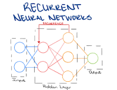
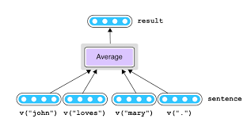
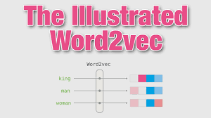
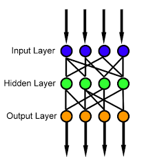
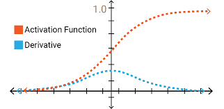
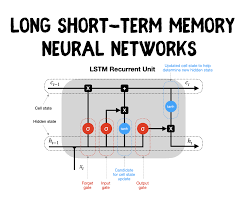
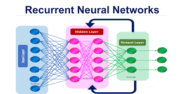

## Intro to RNNs

Recently, language based machine learning models are becoming more prominent than ever. GPT-3 can analyze text almost as perfectly as a human. AI is getting better at understanding the human language, both in writing and in speaking. But how is all of this possible? Well, we can thank Recurrent Neural Networks, or RNNs for short. These neural networks allow for the function of nearly all language-based AI in the world. In this article, we will cover the basics of these fascinating RNNs and how they work. 

Key Differences with RNNs: 
For starters, RNNs take in data a bit differently than most other neural networks.
Typically, when training a machine learning model, the data is shuffled from the dataset and THEN it’s fed into the training process. However, for RNNs, the data must be kept IN ORDER. What does this mean? Well, say for example, we want to predict whether a sentence is having a happy tone or a mad tone. Let’s say that the data set contains the phrase “I am very upset today”. For the sentence to make any sense, the words HAVE to be in order. We can’t just scramble the words and give it to the model.

As we can see here, the words must be fed into the model in order

Another unique thing about RNNs is what is known as its Hidden State. The hidden state basically acts as the RNNs’ memory. This hiddens state allows the network to remember pieces of information about a given sequence (hence why it is important to not shuffle inputted data).

While there are many other features that make RNNs amazing, these are just some really cool and unique things about them! Next we will look at the training process for RNNs.  

## Training RNNs

Surprisingly, RNNs have a fairly similar training process to most other neural networks. However, there are still some differences. 

To start, RNNs typically require massive datasets. This is because many languages, English included, have so many words. Larger datasets allow for more accuracy and expose the model to much more diverse data. 

Before we can start training our model, there is one key thing to remember: At the end of the day, Neural Networks take in numbers. We can’t just input a phrase like “I like apples” We have to transform these words somehow into numbers. The best way to do this is through word embeddings. There are public architectures that we can use such as [word2vec](https://www.tensorflow.org/tutorials/text/word2vec). 

After getting our numerical data, we must first input one piece of data at a time, such as a single word or phrase. However, our model must also take into account previous pieces of data to make predictions/evaluations. Thus, RNNs pass on the data multiple times between layers. 

Based on whether our evaluation for our training data was right or wrong, the model adjusts its weights and biases in an attempt to create a more accurate version. However, this backpropagation in standard RNNs leads to a major flaw: the vanishing gradient problem. During training, as backpropagation occurs, the model uses previous weights to make adjustments. Eventually, this leads to the model forgetting words that were from far away sequences and only using words from the most recent sequences. 

Vanishing Gradient Problem Modeled on a Graph 

	
To combat the Vanishing Gradient Problem, more powerful RNNs are often used, such as the LSTM model. This model has feedback connections instead of feedforward connections like most models do.  

			
Simple Architecture of LSTM Models

## Popular RNN and NLP Frameworks

There are many frameworks out there for making RNNs and NLP based models, many of them open-source. Standard deep learning model frameworks such as Tensorflow support the creation of RNNs. Check out this tutorial: (https://www.tensorflow.org/guide/keras/rnn ) However, to create more specific language based models, there are other frameworks that are easy to use such as SpaCy and NLTK, which uses python to create ML models. 

## Conclusion

So what did we learn from this article? We learned the basics of RNNs, including what they are typically used for and how they work. We also looked into detail the training process for these RNNs and possible issues that might occur within them, such as the vanishing gradient problem. Overall, RNNs are a fascinating form of neural networks that lay the foundations for all language-based AI in the world.

