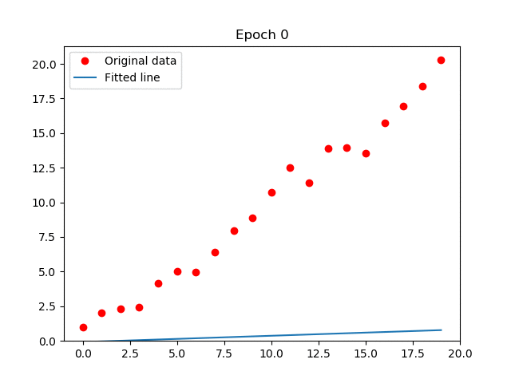
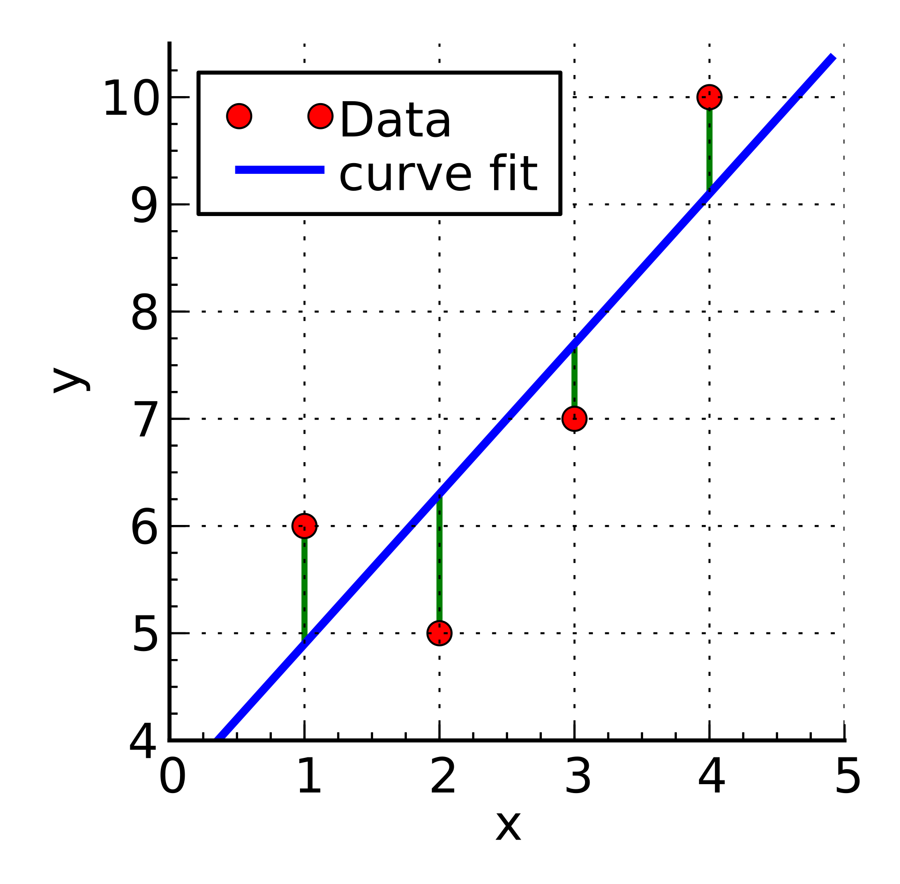
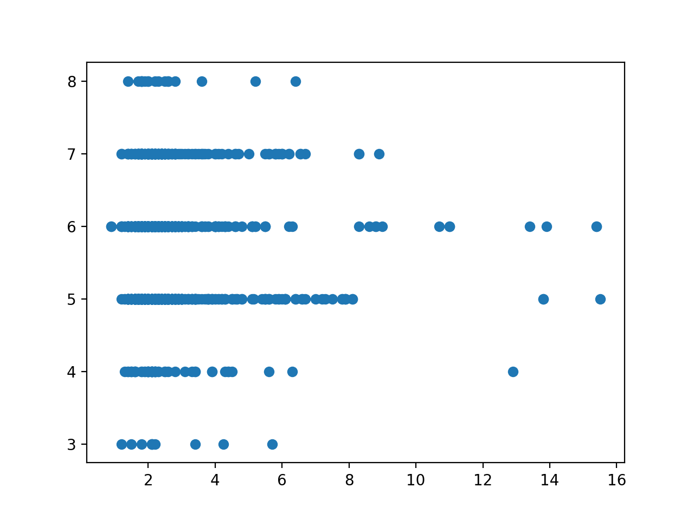
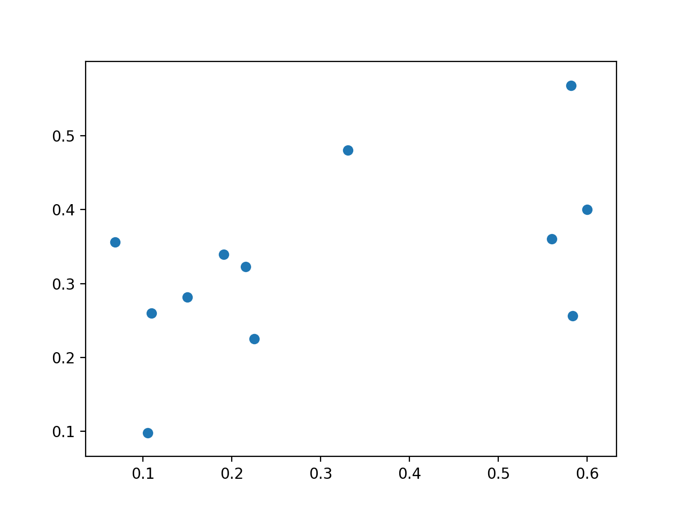
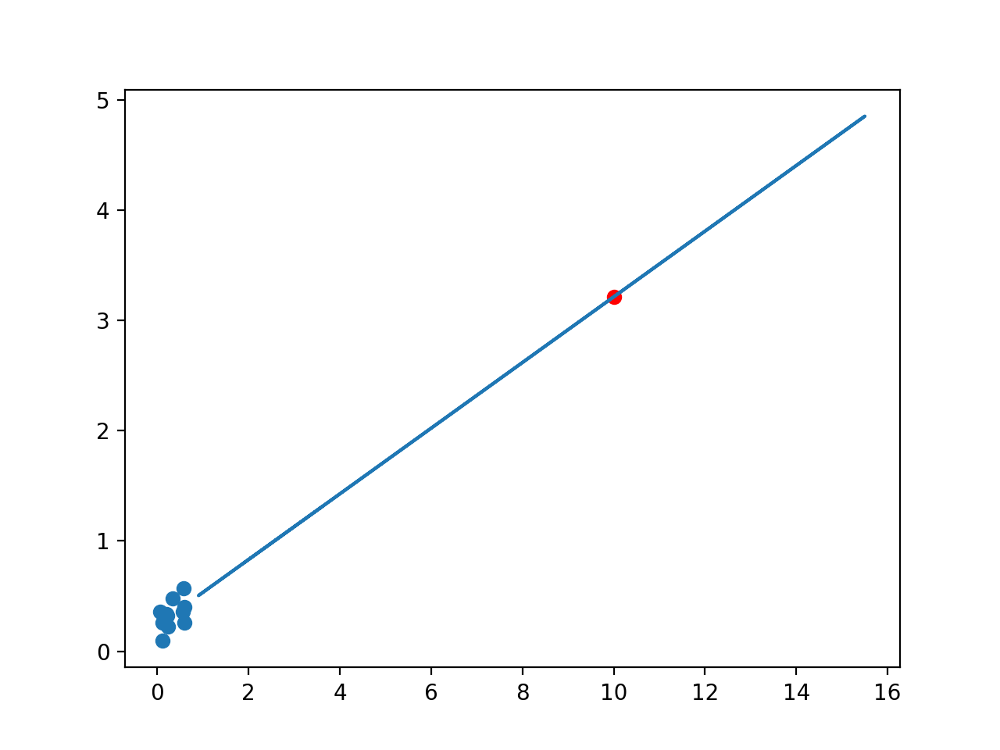

## Background
Linear regression is a simple machine learning technique that uses a line of best-fit (y = mx + b) to model a set of data. As coefficients m and b are optimized through training, the model yields better predictions. A visualization of a two variable linear regression algorithm training is shown below: 



Usually, regression models are trained through a gradient descent algorithm. In short, the mean squared error (MSE) is calculated between each datapoint and a corresponding point on the regression line:



​​These differences are then summed to produce a total error that is minimized by the algorithm over time.

In this tutorial, we will write a simple, two variable linear regression algorithm in python. The goal of this mini-project will be to predict the quality of red wine based on its residual sugar content. The link to the dataset used is included [here](https://archive.ics.uci.edu/ml/machine-learning-databases/wine-quality/).

## Code
First, let’s import all the necessary modules. In this specific walkthrough, we will be using numpy and pandas for data processing, sklearn for the regression model, and matplotlib to visualize the results. 

```py
import numpy as np
from sklearn.linear_model import LinearRegression
import matplotlib.pyplot as plt
```

Next, we’ll read in the relevant portions of the wine dataset.

```py
df = pd.read_csv("wine_data.csv")
#grabbing columns and converting them to formatted arrays
X = df["residual sugar"].to_numpy().reshape(-1,1)
y = df["quality"].to_numpy().reshape(-1,1)
```

It's always interesting to see what our data looks like.

```py
plt.scatter(X,y) #plots the data points
```



At first glance, there are a few things that seem odd about this data. First, we have a few outliers toward higher values of residual sugar. Second, we have multiple different values of quality for the same value of residual sugar. To avoid these problems, let’s normalize our data with a simple scale-fit transform:

```py
from sklearn import preprocessing

x = df.values #getting all data points

#performing normalization
min_max_scaler = preprocessing.MinMaxScaler()
x_scaled = min_max_scaler.fit_transform(x)
df2 = pd.DataFrame(x_scaled)


#visualizing new,indexed data
X = df2.iloc[3].to_numpy()
y = df2.iloc[11].to_numpy()

plt.scatter(X,y)
plt.show()
```

The new data is much better:



Next, we’ll define our sklearn Regression model and fit it with the data. 

```py
reg = LinearRegression().fit(X, y)
```

We can view the coefficient, intercept and fitness score of our model through the following series of print statements: 

```
print("The coefficient is ",reg.coef_)
print("The intercept is ", reg.intercept_)
print("The model's fitness score is ", reg.score(X, y))
```

To find the line of best fit, we use the coefficient and intercept to construct a linear plot (using the equation y = mx + b). For convenience, we store the data points in a numpy array. 

```py
y2 = []
for i in X:
	y2.append((reg.coef_ * i) + reg.intercept_)
y2 = np.array(y2).reshape(-1,1)
```

We can also use our model to predict the y-value for a new X value. Here, we predict the corresponding quality for a residual sugar value of 10. 

```py
print("With an input of 10, the output is ", reg.predict(np.array(10).reshape(-1,1)))
```


With such a high sugar value, the predicted quality of 3.22 seems appropriately low. We can visualize this result on our plot. The blue points are the normalized data, the line is our line of best fit, and the red point is our predicted quality value.

```py
plt.scatter(X,y) #initial data points 
plt.scatter(10,3.22, color = "red")
plt.plot(X,y2) #Line of best fit
plt.show()
```



## Final thoughts
Linear regression is a relatively simple and powerful tool to model sets of data with. If you enjoyed this tutorial, or would just like to learn more, check out some of the other App Dev League content!
