You’re interested in Machine Learning and want to explore ways in which you can implement Machine Learning with App Development. In that case, you’ve come to the right place! In this tutorial, I will be taking you through the steps for creating a Dog vs Cat Classifier using Swift and CreateML. 

Note: You will need access to a MacBook or iMac and Xcode. 

To begin, I will explain Swift and SwiftUI. Swift is an open-source programming language created by everyone’s favourite technology company, Apple. Designed specifically for the creation of apps on iOS, macOS, tvOS and watchOS, Swift provides developers a great degree of freedom through its simple usability. Swift UI is Apple’s framework for constructing user interfaces on the previously mentioned operating systems. SwiftUI allows for developers to create UI in a declarative way, which is extremely easy to learn and implement. 

Now that you understand Swift and SwiftUI, let’s start creating our iOS Classifier Application. 

## Creating Our Xcode Project

1. Open Xcode and choose “Create a new Xcode project”.

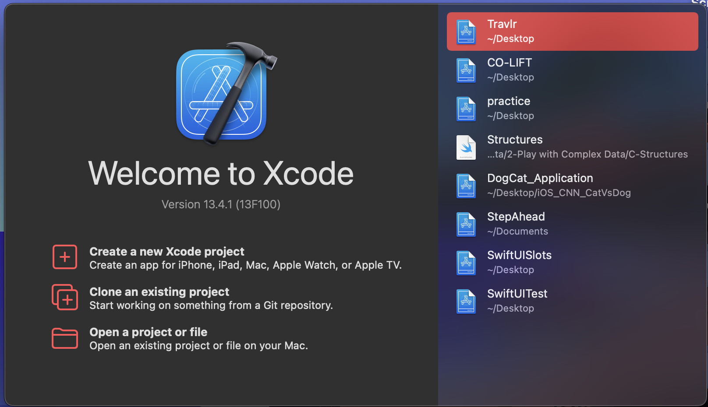

2. Following that, you will have to choose your template, which will be an iOS App. You can do this by choosing “iOS” and then “App” on your screen, and then click “Next”. 

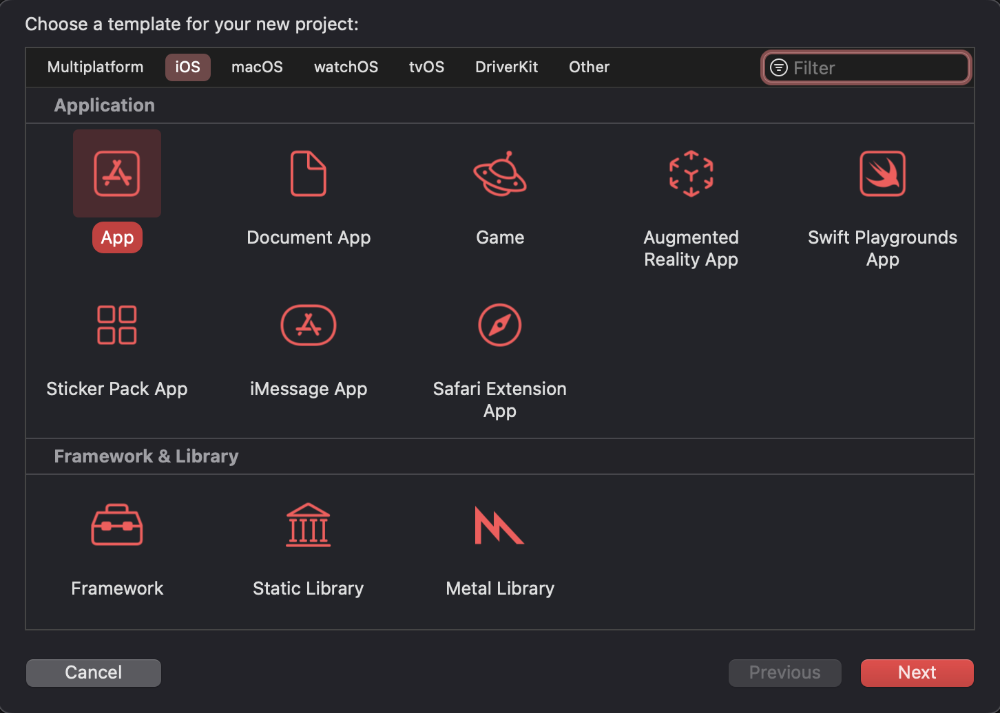

3. You will have to enter a product name. For our purpose, we’ll name our product “DogOrCatClassifier”. Ensure that the interface is SwiftUI and language is Swift. Then, click “Next”. 

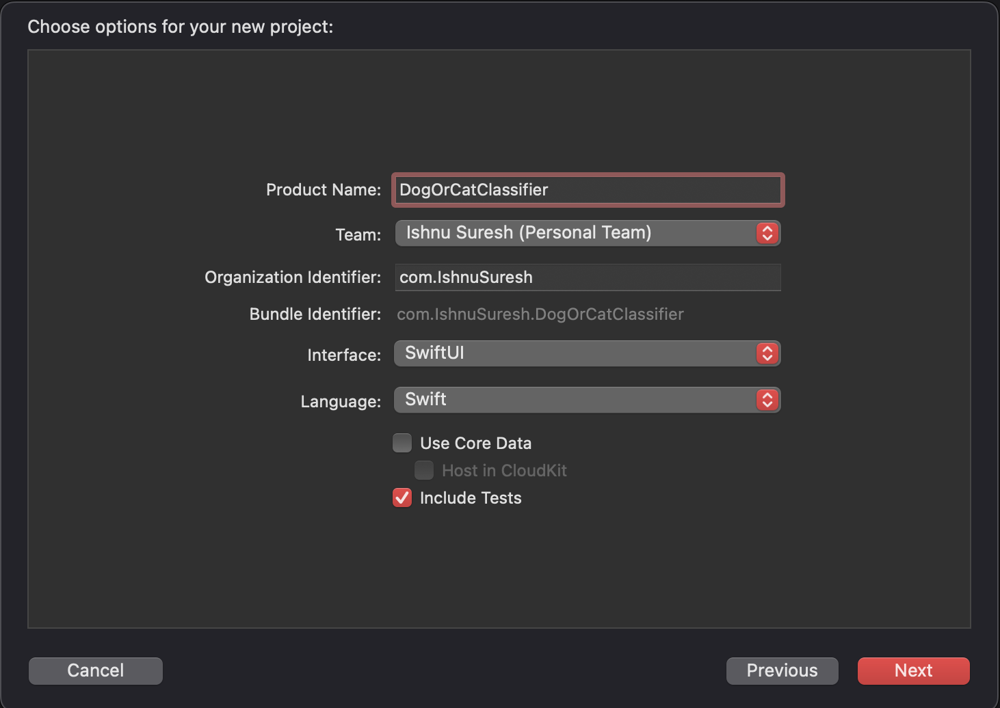

4. Save your project wherever you like! I will be saving mine on my desktop. Your screen should now look like this: 

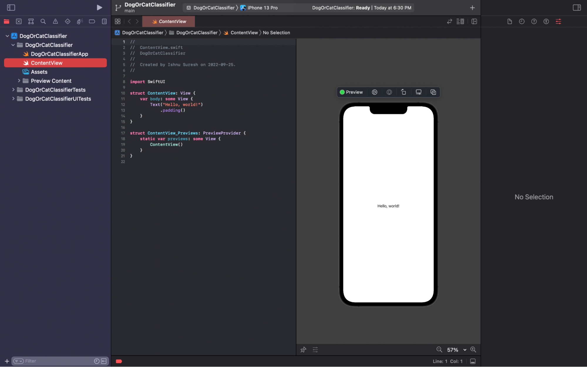

Great work! You’ve now created your Xcode project, in which you will be implementing your Machine Learning Model!

## Creating Our Machine Learning Model

Now that we’ve created our Xcode project, it’s now time to create our Machine Learning Model. We’ll be doing this by using Apple’s CreateML, which allows for developers to easily create sophisticated Machine Learning models on their Mac. In order to do this, we first need a dataset that contains images of dogs and cats. In this tutorial, we’ll be using the following dataset from Kaggle: <https://www.kaggle.com/datasets/arpitjain007/dog-vs-cat-fastai>. Let’s Get Started!

1. Download the dataset and open the zip file. When you do so, you should see something like this: 

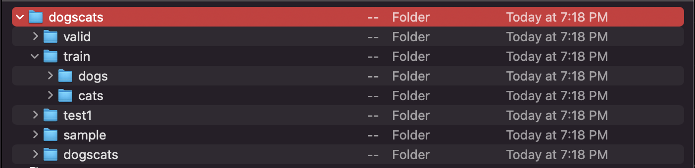

2. Now, go back to Xcode. Click on Xcode at the top of your navigation bar, hover over “Open Developer Tool” and select “Create ML”. 

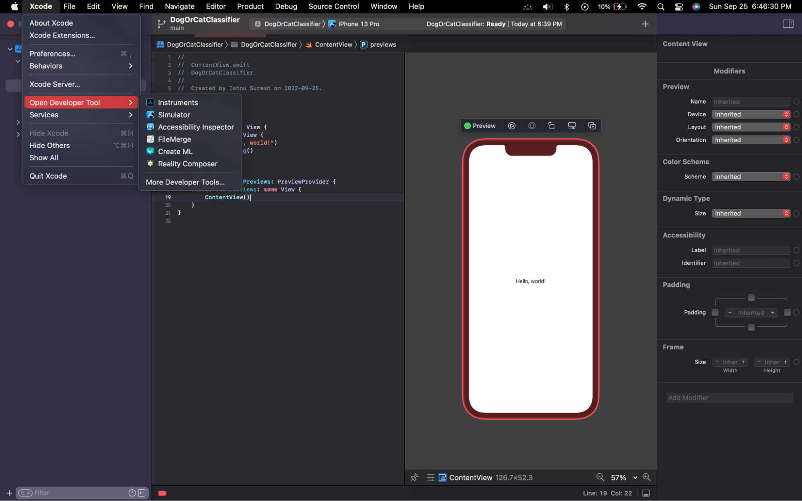

3. Select “New Document” and choose “Image Classification” as your template.
 
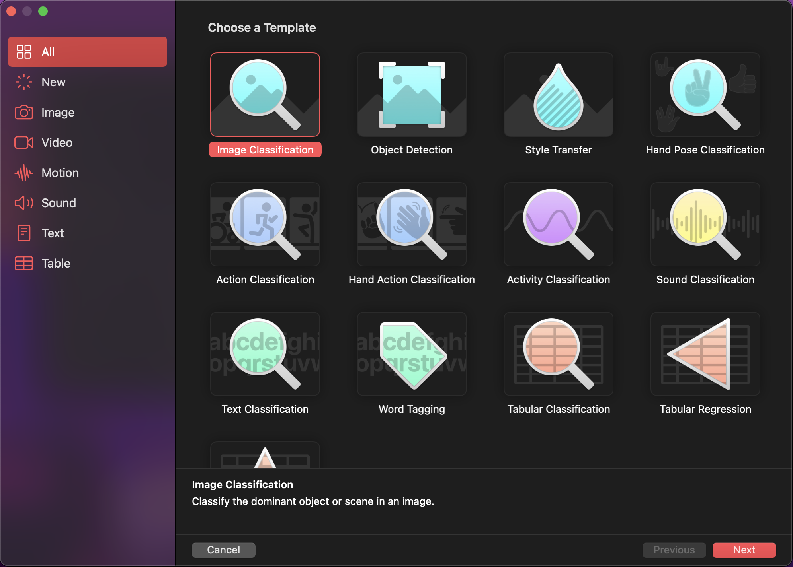

4. Name your project “DogVsCatClassifier”! You can leave “License” and “Description” empty for now. Click “Next” and save your project to your desktop. This will take you to the main CreateML page. 

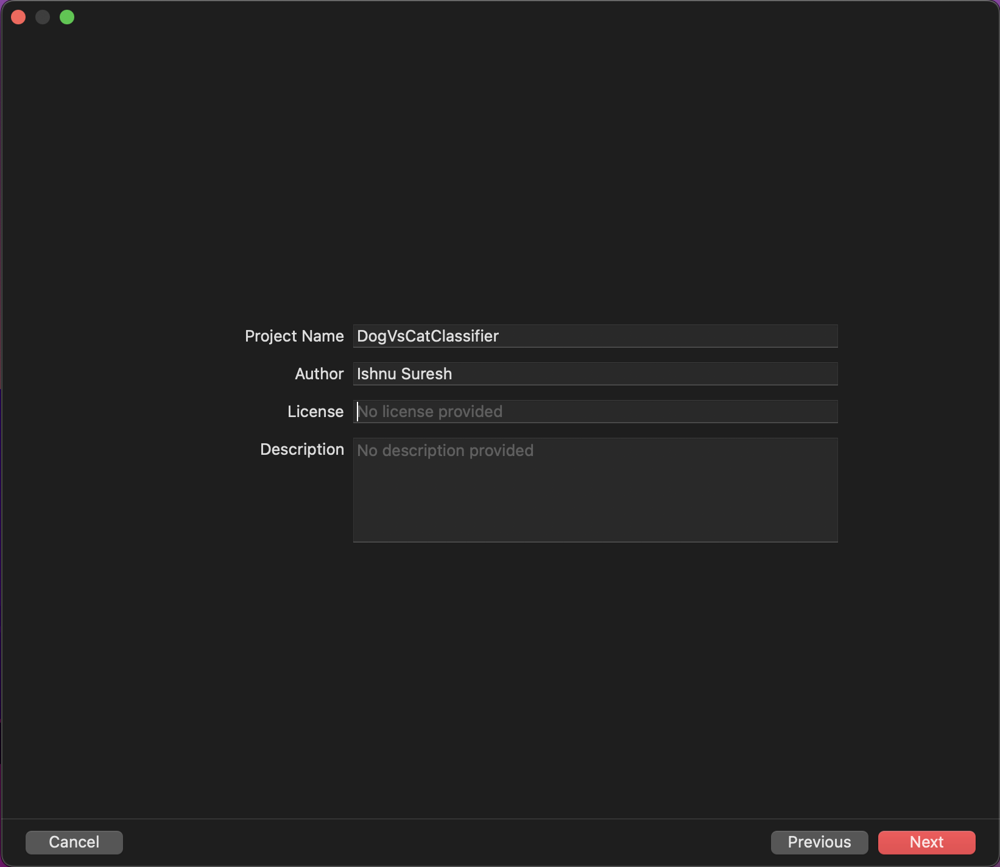
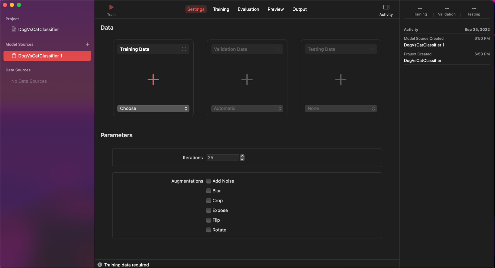

5. Next, you want to click on the highlighted “+” under Training Data, and drag and drop our dataset. **Ensure you select PetImages and not the entire Zip Folder.** When you’re done, you screen should look like this: 

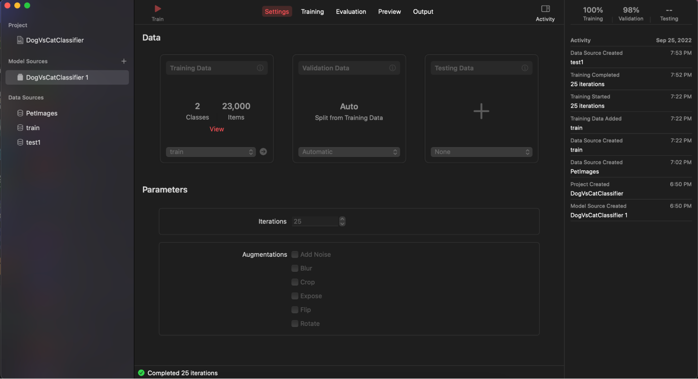

6. Click on “Train”, which is at the top of the screen, and wait for your Machine Learning Model to train itself. Note: This will take some time.

7. After your Machine Learning Model has finished training, you can head on over to the “Preview” tab. Here, you can add images and see your Machine Learning Model in action! 

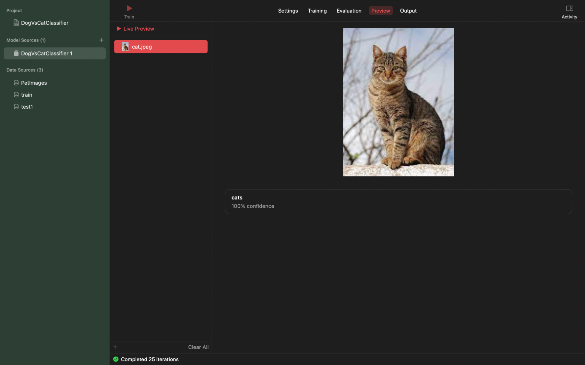
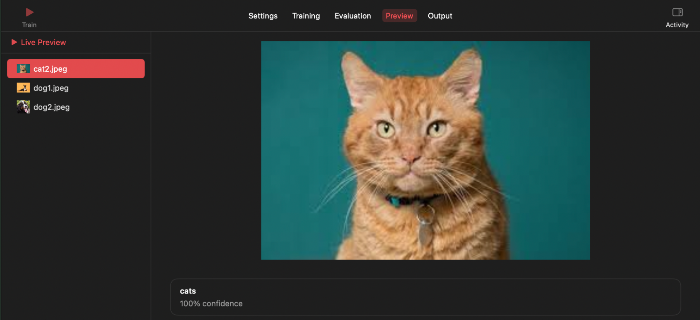
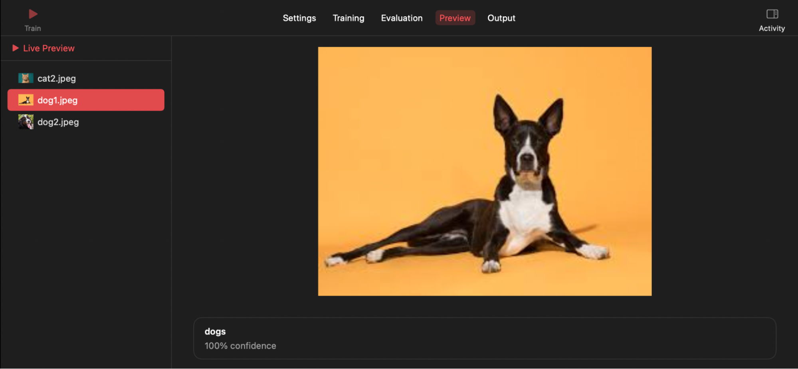
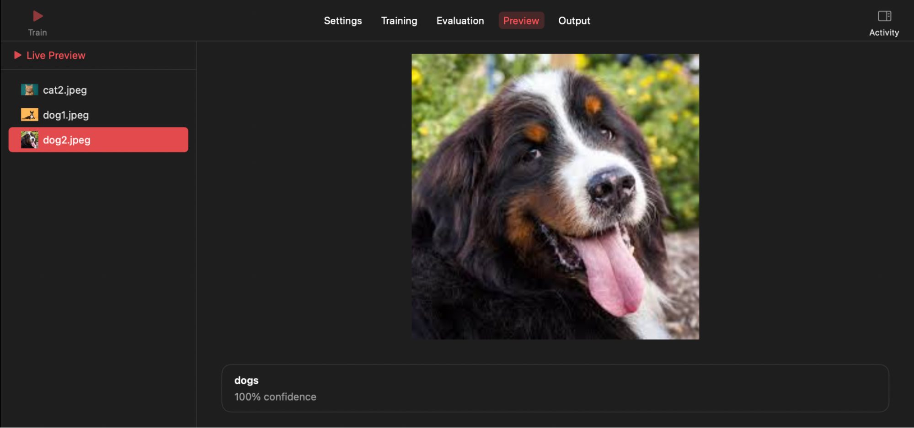

Congratulations! You’ve created your own Machine Learning Model with CreateML!

Next Steps - Implementing Your Model Into Xcode

1. Go to the “Output” tab and click on “Get”. You can save your model to your desktop. Please name the model properly!

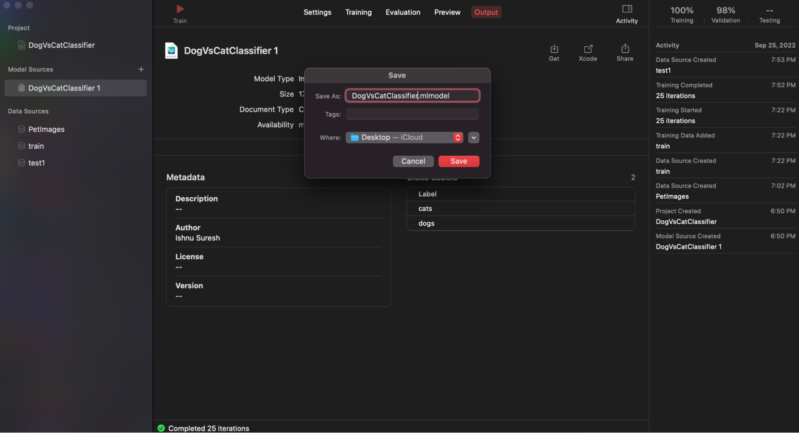

2. Go back to Xcode and drag your Machine Learning Model to the files section. Your files section, should now look like this: 

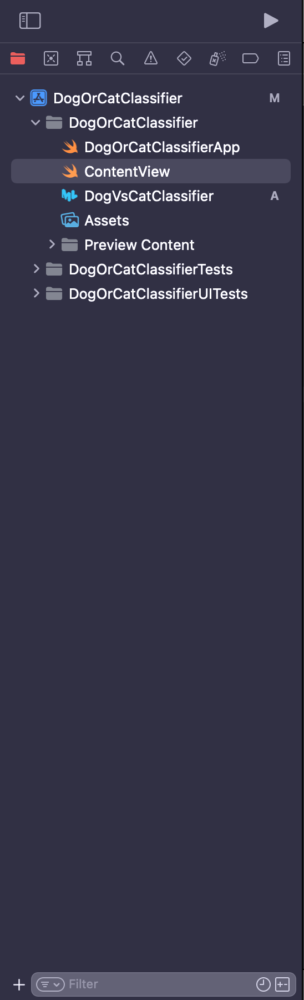

Congratulations! You’ve managed to train a Machine Learning model using CreateML and incorporate it into Xcode. It’s now your turn to experiment with the features of SwiftUI, to create an application that incorporates your image classifier! 
