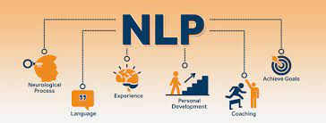
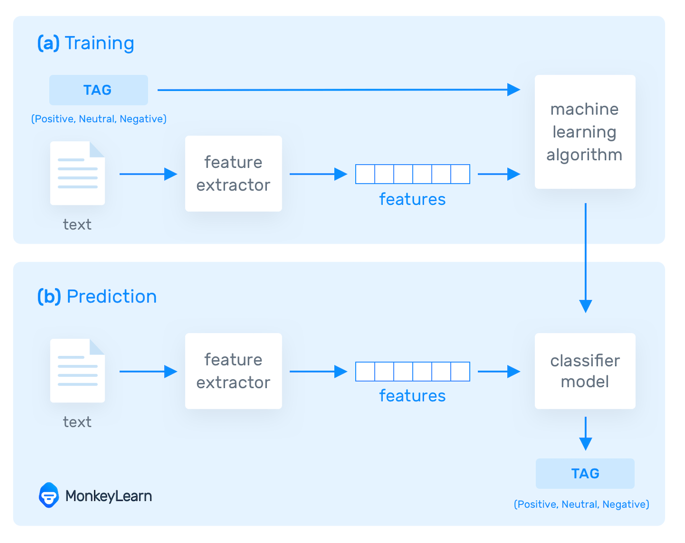
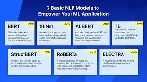
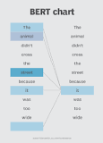
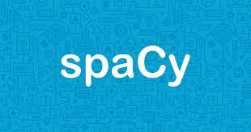
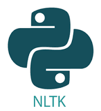

## What is Natural Language Processing? (NLP)

Natural Language Processing is the ability for a computer or machine to be able to understand and utilize human language. You might deal with NLP on a daily basis, from a chatbot, autocomplete search results, and even email filters which differentiate between spam email and important ones. NLP is a growing field of AI and Machine Learning and it’s becoming more and more important by the day. 

## How does NLP Work? 

In NLP, the given form of language is split into chunks that can be analyzed based on grammar and vocab. This helps the model that analyzes this text to better understand the context and meaning. Features are given after an analysis, and this helps the model better learn. 

## What are some popular NLP algorithms?

- GPT2: Generative Pre-trained transformer 2 is an NLP model that can generate text that is grammatically correct and makes sense in its own way. For example, you can ask it a question such as “What is your favorite type of rock?” and the algorithm will generate a sentence that answers the question. This model is extremely powerful and it uses an unsupervised-learning strategy. It was created by OpenAI, a popular AI company today. 

- XLNet: An NLP model that was created by people from CMU and Google. This powerful model can perform a variety of different functions such as sentiment analysis, text classification, reading comprehension, and much more. 

- BERT: An NLP model that was created by developers from Google. This model is used by many people today for a variety of reasons. This model is typically used to understand the meaning of a specific piece of text by using the other text that surrounds it. This model can process large pieces of text at the same time. 

## How does the BERT Model work?
	
The BERT model works by having each word in a given piece of text have its own meaning, completely independent from the context that it is in from the other text that surrounds it. The BERT model then identifies the meaning of the word based on the context itself. This strategy allows the BERT model to learn very effectively as it is able to apply what it learns about a specific word to other sentences that follow it. 
 

What are some popular NLP frameworks?

If you are planning on using traditional Deep Learning techniques: 
- Tensorflow: A framework developed and maintained by Google. It is used to create many industry-standard machine learning models. It has a variety of use cases, from Computer Vision to Natural Language Processing. Tensorflow is a great starting point for beginners as it is very fun and quite easy to use. 
- Pytorch: A framework that is great for Deep Learning. Many Python developers feel right at home with this framework as it resembles traditional Python syntax very well. Many industries use this framework. 

If you want to take a look at some frameworks that are specifically based on NLP: 
- Natural Language Toolkit (NLTK): NLTK is a framework that uses Python to develop highly intuitive NLP models. It also contains many different pre-made NLP models that are a helpful starting point. It can be used to classify, analyze, parse, and tokenize text. 
- Spacy: Spacy is an amazing NLP library that is fun to use. It also contains “dictionaries” of words that are already defined in terms of meaning and grammar! It also doesn’t support just English. You can use a variety of different human languages as well! Spacy is quite simple. 
- Hugging face: Hugging Face contains a set of tools that allow you to develop NLP models. On top of all that, you can also deploy your NLP models to Hugging Face, where you can use it in your own applications. What’s great is Hugging Face has an extremely large community. There are pre-made models on Hugging Face made by developers just like you! It also contains great documentation and datasets for you to use. 

