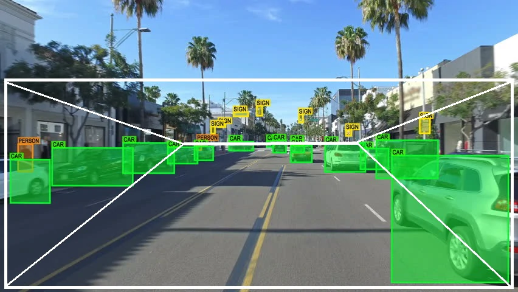
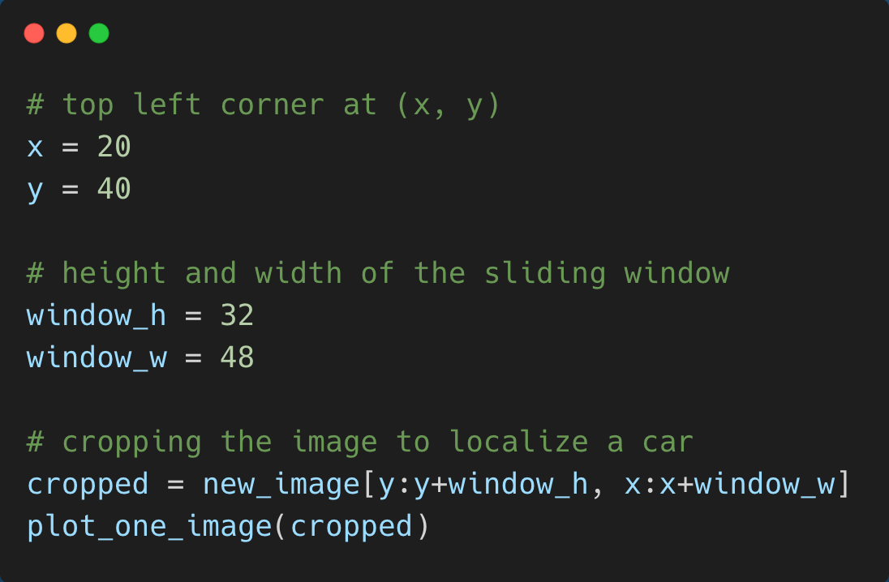
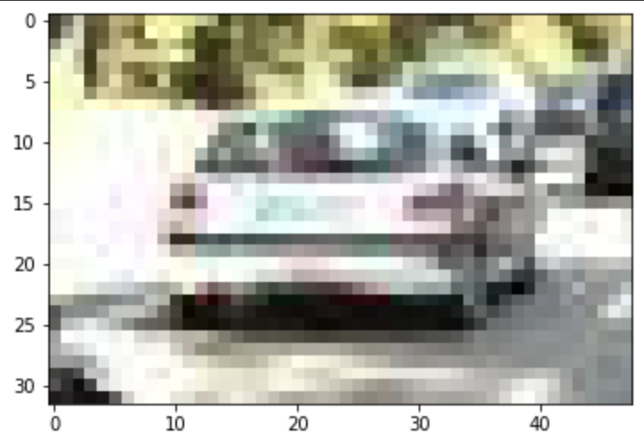
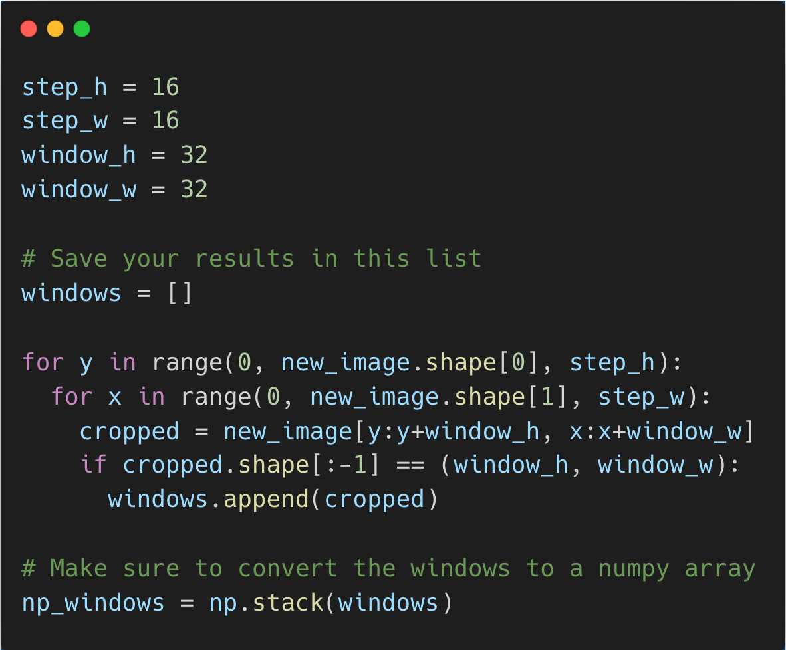
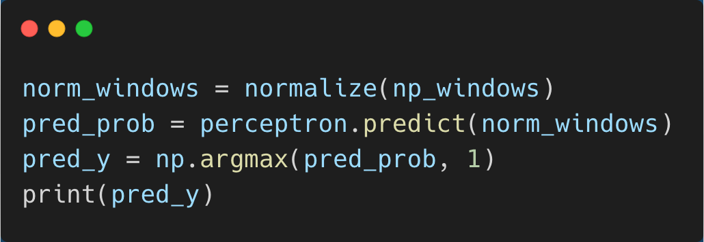
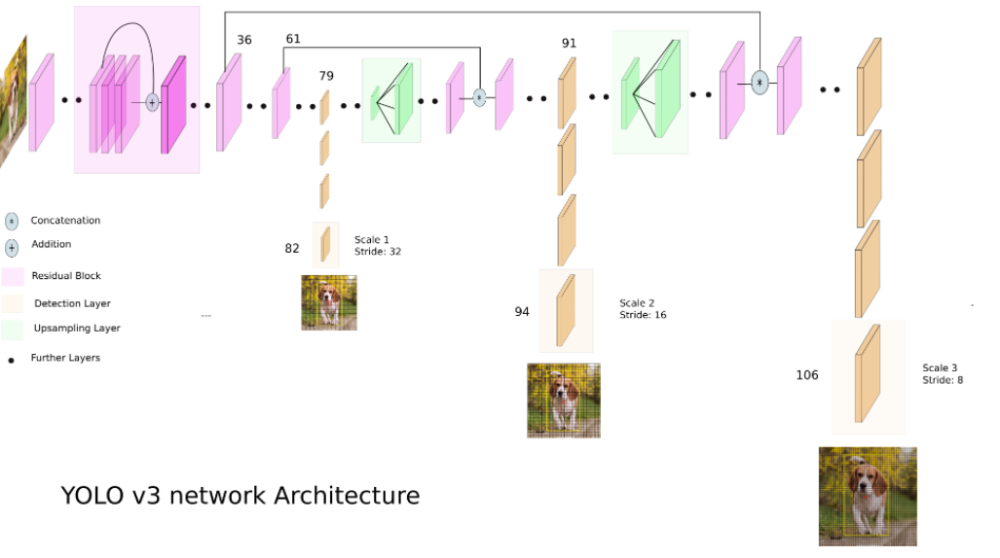
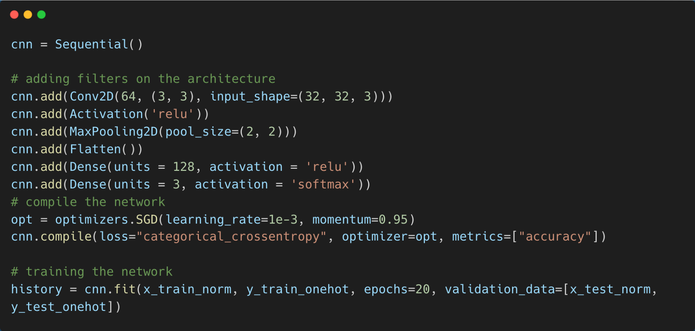

## Overview
Object recognition is a popular computer vision technique that works to identify, locate, and label specific objects within a media format such as an image or video. Specifically, it assists the understanding and analysis of scenes in videos and images. This tutorial will be a simple walk-through for coding a sliding window localization paired with a CNN architecture classification. It will also introduce alternative methods for both of these processes.

## Applications

Because of its usefulness in a variety of fields, object recognition has extended its application most notably to autonomous vehicles. With object recognition, traffic analysis can be facilitated for companies with an auto-pilot feature like Tesla. Moreover, it has also been used in face detection for companies like Amazon, Google, and Facebook. Another application is to detect unfavorable health conditions like tumors and, more recently, COVID-19. Thus, object recognition will impact even more industries in healthcare, security, transportation, and social media in the future.

## Localization
One way to localize objects is by using the sliding window technique. Using a window of a fixed size, we look at cropped images from the scene to locate the different objects present in the image.

All we need to do is define a size for the window and a corner of the window (the top left in this case). This produces a cropped image like the one below. 

Now, just add multiple of these cropped windows to an array that will become our x_test dataset as we will be performing predictions on the sliding windows.

After training a vanilla perceptron model, we can perform our predictions now on a normalized dataset of cropped images from the bigger image as a result of the sliding window.

Another technique that can be employed is YOLO object detection, which stands for “You only look once.” This method splits the image into a grid, which then produces bounding boxes around potential objects of interest inside those grid boxes. Thus, YOLO enables us to directly predict what type of objects are inside those bounding boxes after post-processing. There are three layers to the YOLO architecture. First are the residual blocks, where a non-linear activation function is applied to the input as the input goes sequentially deeper through the nodes. Next are localizations with different scales of the image, where an image is downsampled to be three various, smaller images and detection is performed on these three samples. Finally, the third layer consists of the DarkNet outputs, which are outputted by the detection kernels on the feature maps of the image.

## Classification
What we will be using in the code today to classify the objects detected will be neural networks, specifically convolutional neural networks. With 3 channels for RGB input images, a convolutional neural network takes a portion of the image and summarizes important features from the image, which are then compiled to form a full image. This process is repeated with different filters, and an activation function is applied for the resulting probability of the class/category that the image belongs to.

Another technique often used to classify objects is transfer learning. Recently, this method has been increasing in popularity for its higher accuracy and efficiency. Transfer learning is the use of existing and pretrained models to predict the category of an image. Some popular models in object detection include VGG16, VGG19, and ResNet50.