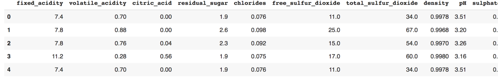
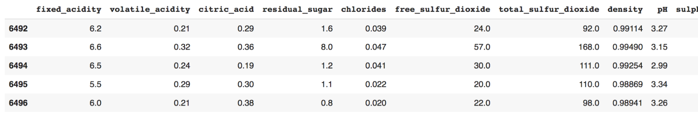
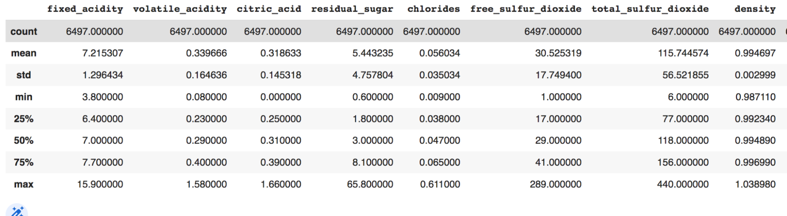
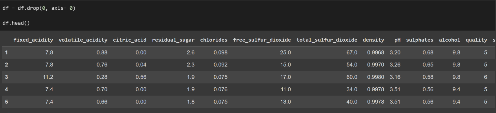
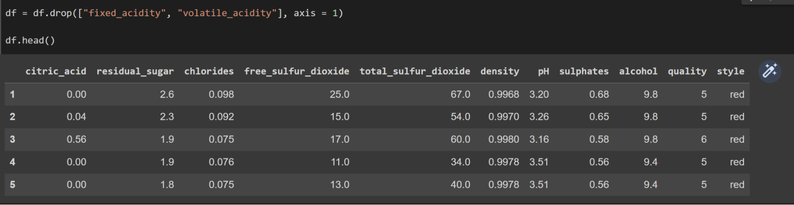
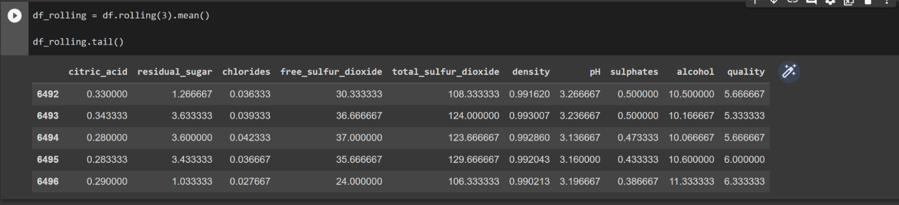

This Article Assumes Basic Python Knowledge.

Data used in this article can be found here: 
[Wine dataset | Kaggle](https://www.kaggle.com/datasets/dell4010/wine-dataset?resource=download)

Code for this article can be found here: [PythonPandasADL.ipynb - Colaboratory](https://colab.research.google.com/drive/1hhbnb8HmWOyQosT-6qHmsgfASf9u52LU)


## Introduction
	
We all know that data is a fundamental part of data science and AI. Our machine learning models need data to learn and make accurate predictions for the future. However, when we get the desired dataset, we often don’t get the exact format of data we need. What if there are rows missing? What if there is an extra column that we don’t need? These are all common problems that data scientists deal with. Luckily, using Python and Pandas, we can manipulate our data programmatically and get the dataset we truly need. 

## Getting started

To get started, we need to install Pandas. That can be done with

```
pip install pandas
```

After it has installed successfully into your environment, test it out by running:

```py
import pandas as pd
```

If all works well without errors, you are good to go!

## Importing Our Data

One of the best things about Pandas is that we can feed it datasets directly through our local file system. If you are running this on your local IDE such as VSCode, simply run:

```py
import pandas as pd

df = pd.read_csv("FILE_PATH_TO_YOUR_DATA.csv")
```

The read_csv function takes in a string that points to the CSV file in your directory. It then stores it into the df variable as can be seen above. 
This article uses Google Colab as its environment and an easy way to access files there is to use the following code: 

```py
from google.colab import files
import io

uploaded = files.upload()

df = pd.read_csv(io.BytesIO(uploaded['FILE_NAME.csv']))
```


For this article, we will be using the wine dataset from Kaggle. ([Wine dataset | Kaggle](https://www.kaggle.com/datasets/dell4010/wine-dataset?resource=download))

Now that we have our file name, change the above code to: 

```py
from google.colab import files
import io

uploaded = files.upload()

df = pd.read_csv(io.BytesIO(uploaded['wine_dataset.csv']))
```

## Viewing Data

Now that we have our data in the df object, how do we see our data? Luckily, Pandas has easy ways for us to see it! To see the first 5 rows of data, we must get the head of the data. To get the last 5 rows of data, we must get the tail of the data. To see the entire dataset, all we have to do is print out the dataframe object!

```py
# View First 5 rows of data
print(df.head())
```

This returns:  


```py
# View Last 5 rows of data
print(df.tail())
```

This returns: 



```py		
# To view the full dataset
print(df)
```

## Getting Data Information

Now that we know what our data looks like, let’s try and break down what it means. The first row of a pandas dataframe always has an index of 0, just like a normal Python array. The row of attributes on top such as fixed_acidity, citric_acid, and more are the columns/features of the dataset. While the wine dataset has all numerical data, it doesn’t always have to be. To view data types, row count, and column count, simply use the built in Pandas function, count:

```py
# Returns basic data information
df.count()
```

The function above returns the following information:
```
     fixed_acidity           6497
     volatile_acidity        6497
     citric_acid             6497
     residual_sugar          6497
     chlorides               6497
     free_sulfur_dioxide     6497
     total_sulfur_dioxide    6497
     density                 6497
     pH                      6497
     sulphates               6497
     alcohol                 6497
     quality                 6497
     style                   6497
     dtype: int64
```

As we can see above, the dtype section of the response gives the type of variables the dataset contains. In this case, it is all int64. The 6497 represents the amount of rows that contain the given column. Seeing as it equals the total row count and they are all the same, we know that there are no missing columns in the rows. Sweet!

Another great function that Pandas has for us is the describe function.This function allows us to summarize information about the data. We can get useful information for each column such as the averages, standard deviations, and much more.

```py
# Describe our data
df.describe()
```


This returns:



One important thing to remember is that columns in a Pandas dataframe are elements of an array.This means we can access information about specific columns in the dataframe as if we were trying to access elements of an array.

```py
# To get access to the "fixed_acidity" column
df["fixed_acidity"] 
```

This returns the individual elements for each row of that column: 

```
0        7.4
1        7.8
2        7.8
3       11.2
4        7.4
        ... 
6492     6.2
6493     6.6
6494     6.5
6495     5.5
6496     6.0
Name: fixed_acidity, Length: 6497, dtype: float64
```

## Manipulating Data

Now for the fun part: data manipulation! Here, you will see how to alter and change our dataset to our needs. 


	
### Removing Rows

A fundamental part of data manipulation is removing data that isn’t needed. There are many reasons as to why we might want to do this. Some of the rows in our dataset might be missing values. Or, we might have multiple of the same rows. In either case, we want to remove the rows as it might skew results in our machine learning models. Thankfully, Pandas has a built-in function for this called the drop method. This method takes in an index to remove, as well as an axis. This axis parameter is vital as it tells pandas whether we want to manipulate the dataset on the X axis or Y axis. 



As can be seen in the image above, we must use the drop method on the dataframe object. The 0 in the first parameter tells us that we want to drop the row of the 0th index. We set the axis to 0 to signify that we are referring to a row rather than a column. It is important to note that we have to set df to itself every single time we change the dataframe, otherwise, our changes will not save!


## Removing Columns

Removing columns is a very important part of data science. Oftentimes, datasets have columns that refer to variables that we don’t need. For example, say in our wine dataset, we didn’t need the fixed_acidity or volatile_acidity columns. It may be because these columns don’t provide our machine learning model with any important information. 

Dropping a column in Pandas is very similar to dropping a row. We must still use the drop function on a dataframe. However, we must set the axis to 1 to signify that we are manipulating the Y axis. Another great thing is that we don’t have to worry about index numbers. Rather, we can input the name of our column as a string. We can also remove multiple columns at a time if we input the column names as a list. Remember that you must set the dataframe to itself in order to save changes. 

	
	
## Rolling Mean (Extra Topic)
Now that you know the basics of Pandas, let’s do something fun! Finding the rolling mean of a dataset is a very important part of data science. It helps smooth out data and find broader predictions within a dataset. It basically creates a new dataset by taking the values of every n rows and finding the average of those values.



As can be observed above, we are taking every 3rd row of the dataset and we are finding the mean. We then store this new dataframe into the df_rolling variable. When we print out the values of this new dataframe, we can see that we now get the averages rather than the original values. 


## Conclusion
In this article, we learned how to read CSV data from our system. We also learned the fundamentals of Pandas. We learned how to view basic dataset attributes and basic data manipulation, such as dropping rows and columns. Finally, as an added bonus, we learned about rolling means and how to find them using Pandas. Overall, we found out how easy yet useful Python and Pandas are to use for data science. 

