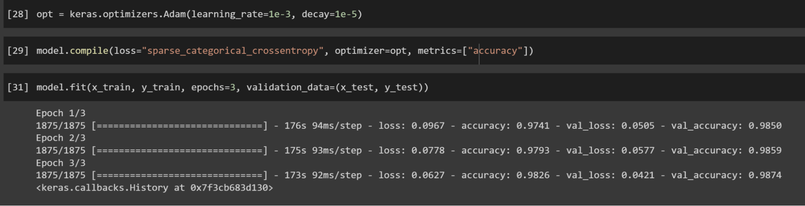

<!-- @format -->

NOTE: The code used in this article is from [Sentdex on YouTube](https://www.youtube.com/watch?v=BSpXCRTOLJA)

Colab For this Article: <https://colab.research.google.com/drive/1y6svKr8y_7Rkxz8KeW6H8M0c9O3C-tRp?usp=sharing>

## Introduction

In this article, we will do a code walkthrough for a RNN. This Neural Network will use Tensorflow and Keras with the MNIST dataset! This dataset will utilize the concepts of RNNs to predict handwritten digits. If you don’t know what RNNs are, or how they work, feel free to take a look at this article (https://docs.google.com/document/d/1gTYbgXynWJJTdWXn7Rcv3FEBuaq8a8vp0SXn5pnBp9c/edit?usp=share_link).

## Getting Started

To get started, we must first identify the dependencies, packages, and libraries that we will need to use. We already know that we will be using Tensorflow, Keras to be more specific. However, we need to identify what model and layers we will be using for our RNN. In this article, we will be using the Sequential model with the following layers for our model: Dense, LSTM, and Dropout. We will go more into depth on what each layer will do for us.

## Observing our Data

Now that we have all our libraries imported, why don’t we take a better look at our MNIST data? Again, the dataset that we will be using is the handwritten MNIST dataset. We can acquire this dataset directly from the Tensorflow framework.

After our data is done loading, let’s take a closer look at it. We know the data is in an image format, so let’s view the shape of the features and labels.

As we can see here, we can see that we get back (60000, 28, 28). The 28x28 means that the image is 28 pixels by 28 pixels in size. We can also see that we have 60000 pieces of data in our training set features.
As for our training set labels, we simply get back 60000. This 60000 just represents the number of labels we have for each piece of training data. (This makes sense as we are training the model on 60000 pieces of data, so we should have true labels for all of them).

Another vital step is normalizing our data. Our neural network will be able to train much quicker and much more efficiently if we do so. Because our data is made up of a matrix with values ranging from 0-255, if we divide all the values by 255.0, we can get much smaller numbers that are in between 0 and 1.

Normalizing our data

## Creating our Recurrent Neural Network

Now, let’s get to the fun part: creating our RNN! The first/input layer in our model will be the LSTM Layer. LSTM stands for Long Short Term Memory Networks. This layer type essentially enables our model to learn off of previous sequences of data. This concept is fundamental for all RNNs. We must set the return_sequences parameter to “True” so that our next layer can get the appropriate data shape for processing. Our input_shape must be (28, 28) due to our pixel sizings.

The Dropout and Dense layers that follow allow for our model to be more accurate. The Dense layer connects all its nodes to all other nodes of the next layer. The Dropout layer temporarily sets inputs to 0 for certain nodes/connections. The 0.2 means that we want to set 20% of the inputs to zero. The activation=”relu” means that we want to use the rectified linear unit function for activation. This function is the standard for most ML models. However, for the last layer, we are going to have to use the softmax activation function so we get an output of a normalized probability.

Our completed model should look like this with all the layers!

After we set our compilation functions and everything, we can finally start training! In this article, we will train the model for 3 epochs.

## After Training

If you observed the results of the model, you may have noticed that the accuracy for both the training and the validation process was quite high.

Although RNNs are typically used in NLP-related situations, we can see here that it also works for classifying images. RNNs have the ability to memorize and adapt from previous sequences. We highly recommend playing around with the code and changing it to see if you can get different results. Try rearranging the order of the layers and tweaking the amount of epochs.

Colab link: <https://colab.research.google.com/drive/1y6svKr8y_7Rkxz8KeW6H8M0c9O3C-tRp?usp=sharing>

## Conclusion

In this article, we did a code walkthrough on Recurrent Neural Networks. We used Tensorflow and Keras to create our model. We also learned more about the layer types in RNNs and how to use them. It’s important to note that there is a lot more to learn about RNNs and the best way to do so is with practice! Feel free to play around with the code to see if you can get different results and accuracy levels. Also look into different RNN techniques and implement it into the neural network! You can also try building an RNN for a NLP-based solution. There are so many fun and useful things you can do with RNNs. Further resources on Recurrent Neural Networks can be found on the internet, such as with the Tensorflow website.

