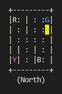
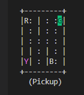
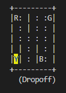
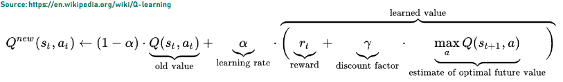
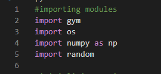
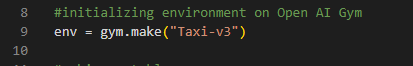
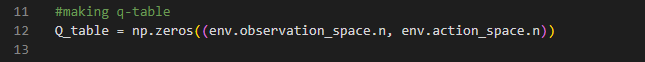
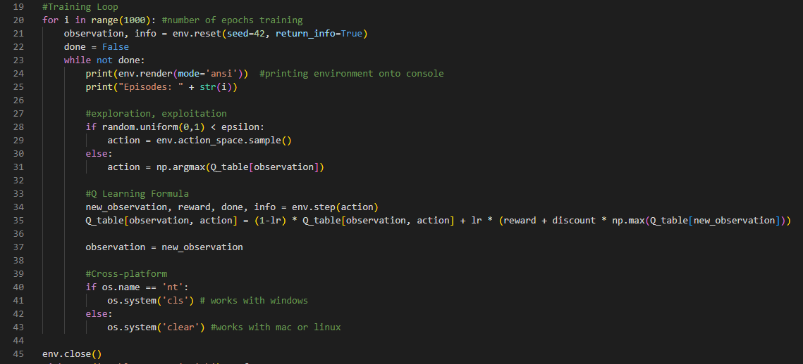
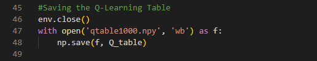
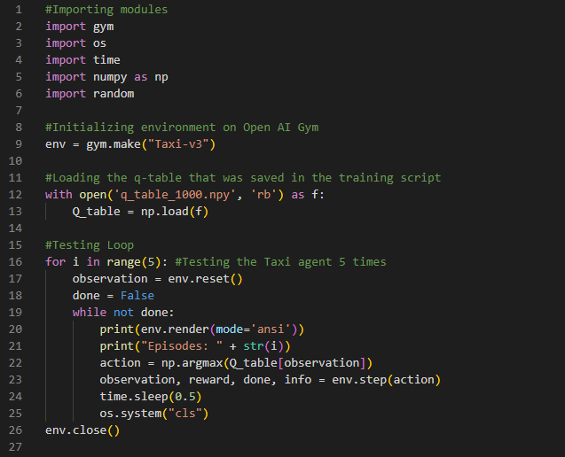

Ever since the 1950s, human beings have been intrigued by the concept of artificial intelligence. In the past, computers could only be explicitly programmed instructions to complete day to day tasks. Without these instructions, computers could not serve any purpose. But, with the concept of reinforcement learning, artificial intelligence is getting closer than ever for machines to mimic the human brain and learn on their own.

## What is artificial intelligence and reinforcement learning?
Artificial intelligence refers to the ability of computers to execute tasks that normally require the human brain. For example, voice recognition technologies allow virtual assistants such as Siri and Alexa to understand human beings.  Machine learning, a subset of artificial intelligence, is a field in computer science in which machines use past data to perform tasks without being explicitly programmed to do so. Reinforcement learning is a promising area in machine learning where a machine essentially seeks for the highest possible reward over a series of actions. For example, when the machine performs an action that the user wants, it will receive a positive reward, and if the machine performs an action that the user does not want, it will receive a negative reward. This reward system is the foundation of reinforcement learning. This is where reinforcement learning got its name as this process is called reinforcement.

## An Analogy
Reinforcement learning uses trial and error to learn. To put this into perspective, reinforcement learning is similar to the learning process a dog undergoes. When you first bring a dog from a shelter, it does not know anything about its owner. When the dog performs a desired action, such as sitting down or performing a trick, the owner gives the dog a treat. When the dog performs an undesired action, such as sitting down when the owner asks the dog to perform a trick, the owner would not give the dog any treats. The dog essentially uses trial and error and learns on its own. As the dog learns more about its surroundings and its owner, it will learn and act the way the owner desires more frequently.

## Terms of reinforcement learning
- Agent - The agent is the component which makes the decision on what action to take. Coming back to the analogy, the agent is the dog.
- Environment - The environment is the world and surroundings in which the agent interacts with. In the case of the analogy, the owner’s home and the owner would be the environment. 
- Reward - The reward is what the agent is trying to obtain. The agent’s goal is to get the maximum reward. The treats given to the dog would be the reward.
- Action - The action is how the agent interacts with the environment. The decisions that an agent makes determines whether or not the agent receives a reward. The action would be the dog sitting down or performing a trick.
- State - The state is the current situation of the environment where the agent takes an action. In the case of the analogy, this would be the owner’s commands and the dog listening to the commands and figuring out what the owner wants it to do.

## Applications Of Reinforcement Learning
- Games - Games can be played by agents so that they can play better than humans. For example, Google Deep Mind’s AlphaGo is an artificial intelligence agent which uses Reinforcement Learning to specialize in the game Go, a Chinese board game. 
- Robotics - Robots can learn to complete tasks using trial and error. Reinforcement learning helps these robots to complete tasks more efficiently than humans as these robots can notice patterns from trial and error and can perform tasks with better accuracy.

## Coding our own reinforcement learning agent with Open AI Gym

### What is Open AI Gym and why are we using it?
Open AI Gym is a package in Python which has a wide assortment of reinforcement learning environments ranging from simple “toy” environments to complex environments such as 3D simulations and Atari video game environments. These environments were created so developers can test different reinforcement learning algorithms and see how agents interact with the environment.. 

In this article we will be using the Open AI Taxi Car environment to illustrate how to get started in reinforcement learning.

## The Taxi Car Problem
The goal of the Taxi Car environment is for the taxi car to pick up passengers and drop them off to the desired location with the least amount of moves.

## Exploring the Environment
After reading the Open AI [documentation](https://www.gymlibrary.ml/environments/toy_text/taxi/) on the Taxi Car environment, we notice that there are 6 possible actions the taxi car can make: move south, move north, move east, move west, pick up a passenger and drop off a passenger. 

The state consists of the row in which the taxi is, the column in which the taxi is, the passenger location (Red, Green, Yellow, Blue, or in the taxi) and the passenger destination (Red, Green, Yellow or Blue). These pieces of information are combined together in the form of a tuple. 

There are a total of 25 possible taxi positions, 5 possible passenger positions and 4 possible destination locations. Overall there are 500 possible states (25x5x4) and our goal is to ensure that, for each of the 500 states, the taxi is able to use the optimal action that returns the highest reward.

The Taxi earns a +20 reward for dropping off passengers in their appropriate destination, -10 for making mistakes when picking up and dropping off the passenger and -1 for every step. There is a -1 reward for every step because we want to minimize the amount of steps the taxi takes. The more steps the taxi takes, the more negative reward it would get. All of these rewards are already pre-set by Open AI Gym.

To progress further we need to talk about the algorithm we are going to be using to solve this problem. 

## Q-Learning Algorithm
Q-Learning is a fundamental algorithm to reinforcement learning. This algorithm finds the best possible action to take, when it is given the current state. 

The Q-Learning Formula

The Q-learning algorithm helps the agent update the current Q-value. The Q Value is Q(s [state], a [action]), the t is the subscript for the state and t stands for current time. Therefore, the current Q-value equals the current state and current action. This value is increased or decreased based on its observation after taking an action such as increasing the Q-value if a positive reward is encountered or decreasing the Q-value if a negative reward is encountered. The discount factor and learning rate are hyperparameters to assist in the training of the agent. The learning rate determines how fast the agent learns. If the learning rate is too high it learns too fast meaning it cannot determine the best actions, if the learning rate is too low, the agent would take too long to train. The discount factor values rewards received earlier higher than those received later as we don’t want to trust the rewards taken in the far future. These hyperparameters must be tuned by trying out various numbers to get the best possible agent. 

## Introducing the Q-table
In order to update Q-values, we need to know the previous Q-values as you can notice in the formula. We store these values in a matrix called the Q-table. The Q-table is initialised with all zeros. During the training these values are updated on the Q-table.So the formula takes the action of the current state. Gets a reward, enters a new state and updates the q-table.

## Exploration and Exploitation Trade-off
Exploration is exploring the environment to find more information about it. To do this, the agent moves at random. Exploitation is the agent making actions based on what is already known in the environment and takes the best action. You may think exploitation would be the best as it would always give the best result, but this would not let the agent learn all the best possible actions in the environment, it would only pick the best from what it already knows. So there must be a balance between the randomness of exploration so the agent has the opportunity to learn the best actions and a balance between exploitation so the agent has a goal to use the best possible action to maximize the reward. The best balance would give the best result for the agent, and to do this we would need to use the epsilon greedy policy. 

Epsilon is the percentage at which the agent explores the possible actions to take on a given state. We randomly generate numbers between 0 and 1, and if the number generated is less than the epsilon we move at random, if it is greater or equal to epsilon then we take the best action  Once we have taken an action, we calculate the reward based on the action and the state, using the Q-Learning formula. Then, we update the Q-table.

## Code Implementation:
Now this is the implementation of the concepts we have talked about to recap and put everything together.

1. Import the necessary modules needed for this project

2. Initalizing the Gym Environment

3. Now we make the Q-Table with the numpy library as this library is all about matrices. 

4. We use learning rate and the discount factor for the Q-learning formula and epsilon is used for the training loop. These parameters can be tuned to get a better agent. 

5. This is the training loop where exploration and exploitation is used, for exploration we use a random action and then for exploitation we use the Q-learning formula. Once the loop goes through all the episodes, the agent is done training. An episode is each time the taxi accomplishes the goal of dropping off and picking up a passenger, it is also when the taxi fails. Overall, the number of episodes I chose to train was 1000, usually more means the better agent you have, less number of episodes mean that the agent has less time to learn the best actions. But, the more episodes you train the taxi for, the longer it takes. For example training for 1000 episodes can take a couple hours depending on the hardware on the machine you're training the agent on.

6. Once the model is trained, it is time to save the Q-learning table for testing

## Testing the Agent
Use this code to test the taxi agent you have trained.

Congrats, the taxi agent is now supposed to successfully pick up the passenger in the blue letter and drop them off in the purple letter!

## Key Takeaways
- Reinforcement learning uses the concept of reinforcement where an agent is punished for negative actions and is given a reward for positive actions in order for the agent to learn how to complete a task through trial and error.
- Some applications of reinforcement learning include self driving cars, robotics and even games
- Open AI Gym is a library in Python with wide variety of environments that can be used for reinforcement learning
- You have also trained your very own reinforcement learning agent with the Taxi Car environment in Open AI Gym.