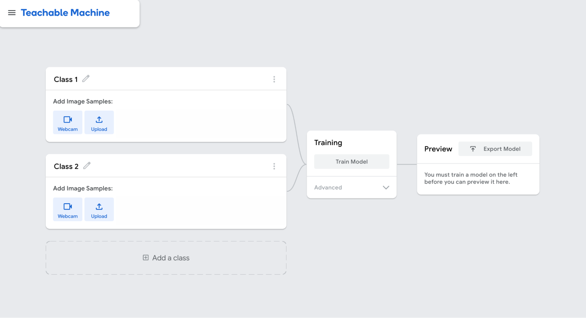
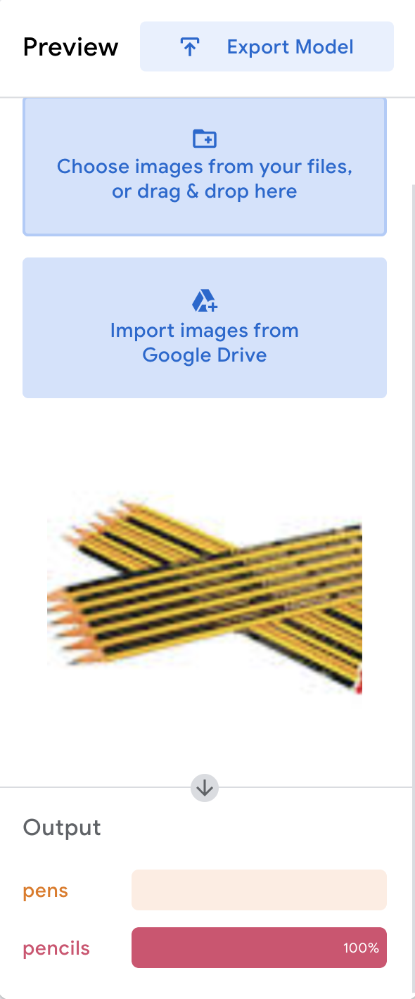

## Overview
Google’s Teachable Machine is an online platform that allows users to easily create machine learning models without a detailed understanding of the math behind them. They are a great way to get started with machine learning and create a simple, practical project. In this tutorial, we’ll use the Teachable Machine platform to build a classifier that uses your camera to differentiate between pens and pencils. 

## Setup 
1. Follow [this link](https://teachablemachine.withgoogle.com/) to reach the homepage of the Teachable Machine website. Click the “get started” button to access the project dashboard.
2. The Teachable Machine platform gives you a choice of 3 different projects: image-based, audio-based, or pose-based. For this tutorial, we’ll be using the standard image model from the image-based project.
3. The Teachable Machine training dashboard should look like this:

  Classes 1 and 2 are the buckets we are trying to group objects into: in this case pens, and pencils. You can rename the classes by clicking the pencil-shaped icon next to their name. 
4. To allow our model to accurately distinguish between writing implements, we’ll have to give it data—namely images of pens and pencils. In general, the more images we give the model, the better it will perform. You can add images to each class by holding different pens and pencils up to the webcam, but in this tutorial, we’ll use a set of images from the web for greater variety within our dataset.
	
5. Now that we’ve added data to our model, we can train it. In fact, training the model is really simple—just click the “Train Model” button. For now, we’ll stick with default hyperparameters for our model, but if you want to customize them, you can do that through the advanced menu at the bottom of the training box. 
6. Finally, we can test our model on new images. You can select the “upload file” option under “Preview” to add a new image of a pen or pencil, and view the model’s  predictions under the “Output” heading. The results should be pretty good!

## Wrapping Up
We’ve just created a basic model that can distinguish between images of pens and pencils. But you can extend this project by adding new classes of images, improving the models by tuning some of the parameters, or adding the models you create to a website—the possibilities are endless! 

That’s it for this tutorial. If you enjoyed it, or are just curious about machine learning, be sure to check out other content from ADL!
