## What is Transfer Learning?
So far, you may be used to creating your own machine learning models and understanding how they work. But, did you know that there already exist highly efficient machine learning models? The architecture in these previously learned models can be repurposed to solve a new problem. This technique is called transfer learning. For example if CNN (Convolutional Neural Network) was trained to classify cars, it can be repurposed to classify trucks. 

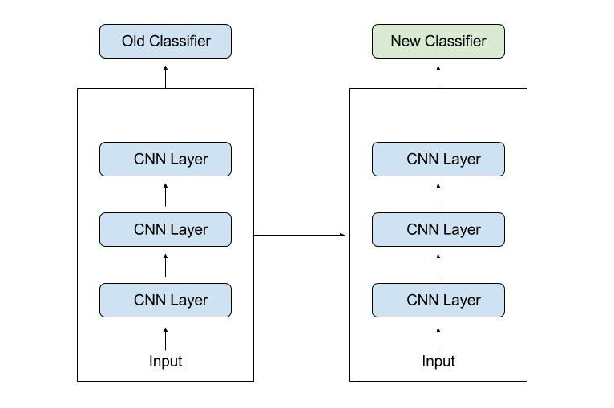

## Why use Transfer Learning?
Using transfer learning has multiple benefits such as saving on training data as most of the model is previously trained. Machine learning models can be time consuming as more complicated tasks can take a long time to train properly, since you may have to spend time playing around with the hyperparameters and layers if you are creating your own model. With transfer learning, these machine learning models do not have to be made from scratch which can significantly decrease the time and resources needed to train the model. Transfer learning is more efficient and powerful as it essentially reuses elements from the previous model and transfers the knowledge it has learned in order to solve a different related task. 

## Applications of Transfer Learning
Transfer learning can be used in many areas of machine learning such as natural language processing, computer vision and neural networks. In natural language processing, transfer learning is used to increase efficiency of machine learning models that deal with linguistics. For example, using a pre-trained model that can detect elements of various languages such as for speech recognition, translation can be used instead of training a model completely from scratch. For computer vision, transfer learning can be used as computer vision requires lots of data. Transfer learning can take models made from large training datasets and these models can then be applied to smaller datasets of images. Overall, transfer learning with neural networks can retain the weights and biases of previously trained models, and aspects of the model can be retrained such as the output layer in order for the model to deal with a different but similar task. Transfer learning can be used on pre-trained models such as the MobileNetV2 which is a machine learning model that was made by Google. The MobileNetV2 was trained on the ImageNet dataset which is a large dataset containing around 1.4 million images with over 1000 classes. This model can then be used to classify something specific such as only dogs with a high accuracy. Some other pretrained machine learning models include [BERT](https://en.wikipedia.org/wiki/BERT_(language_model)), [GPT-3](https://en.wikipedia.org/wiki/GPT-3) for NLP and [VGG19](https://iq.opengenus.org/vgg19-architecture/), [ResNet50](https://iq.opengenus.org/resnet50-architecture/), [EfficentNet](https://paperswithcode.com/method/efficientnet) for Computer Vision.  

## Transfer Learning Walkthrough
We will be using transfer learning to perform image classification. We will be using the MobileNetV2 pre-trained model. For this example I have decided to use this dataset: <https://www.kaggle.com/datasets/misrakahmed/vegetable-image-dataset>

I have clicked “New Notebook” and Kaggle creates a notebook with this dataset where you can train your model. If you wish, you can also download this dataset and use it on your code editor. 

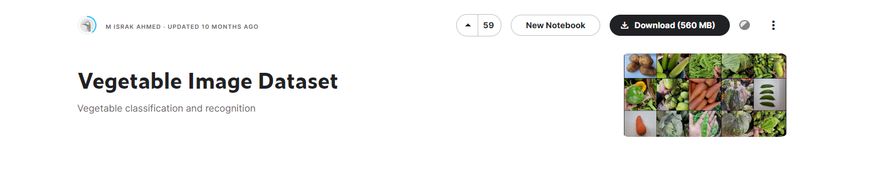

Now these are the required libraries we will be using. We will be using Keras to train the model. 

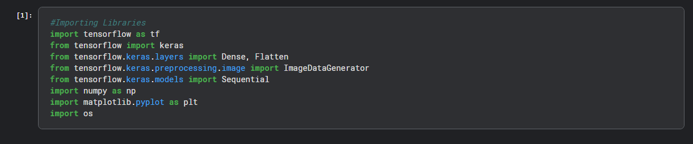

This code helps us load the images from the file directory. 

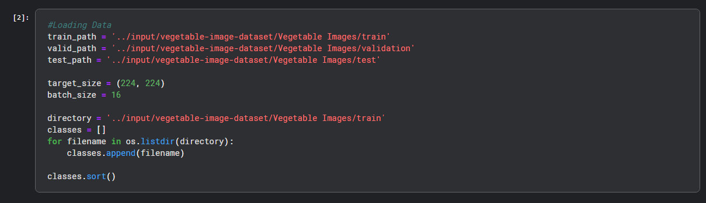

We will be using image preprocessing. 

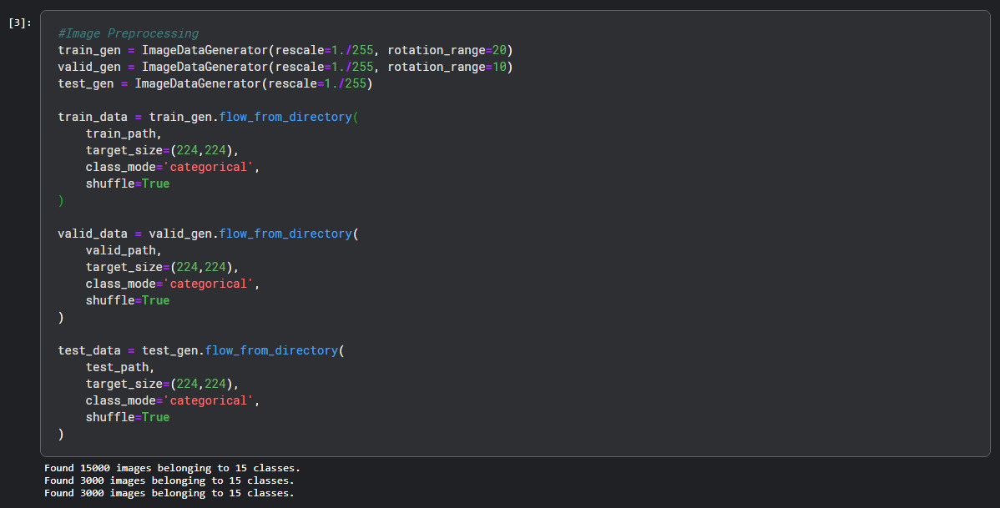

This would be the model architecture, we are using the same weights as the MobileNetV2, but I added an extra layer for output so it can predict the classes for the vegetable dataset. 

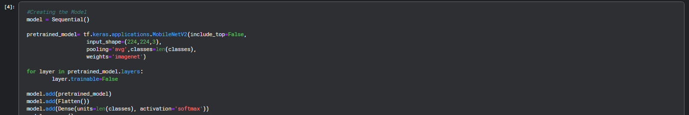

More details about the model architecture can be seen in this image. 

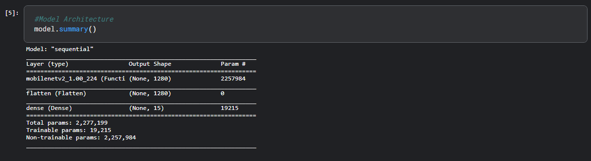

We are compiling the model to get it ready for training, we will be using the Adam Optimizer and Categorical Crossentropy since we have multiple classes for our dataset that we are working with.

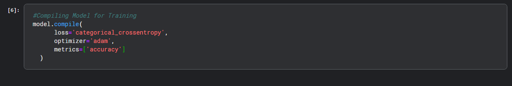

The model was trained with 5 epochs as it has a solid 99% accuracy which is good. 

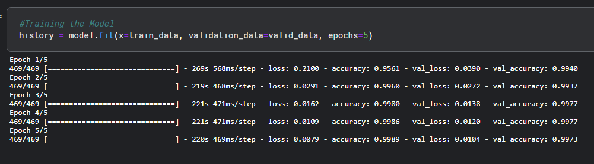

We saved the model so we can test if it works the way we want it.

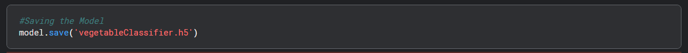

We are now loading the saved model and testing to see if it works as intended. When we test the model, we have to preprocess the images since that is how we feed the images to the model when training, so we have to do the same when testing.

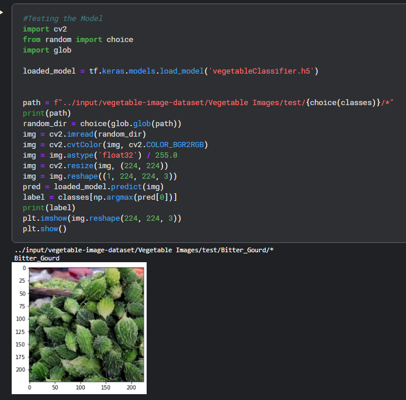

The model is fairly accurate as it provides accurate predictions with the test data. 

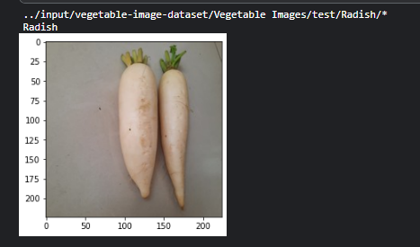
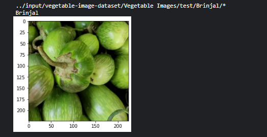
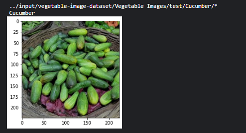

## Concluding Remarks
You have successfully used transfer learning to train a fairly accurate model to classify vegetables. Feel free to modify the code and try other pre-trained models such as the VGG19, ResNet50, etc. Click this [link](https://keras.io/api/applications/) to find more pre-trained models that you can learn about and use. To expand your knowledge on transfer learning, you can explore on Keras’s official website with this [link](https://keras.io/guides/transfer_learning/). The best way to learn is to try things out on your own, so use this opportunity to change up the dataset, the pretrained model and see what you can come up with!