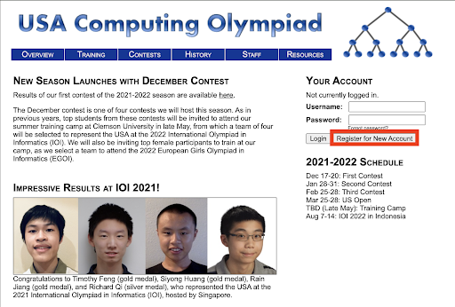

## Introduction

Competitive coding is quite simply writing code and solving problems in a competitive situation. In most contests, you are given a few problems (almost always in the single digits), a few hours to solve them, and the person who solves the most or gets the most test cases correct wins. USACO, or USA Coding Olympiad, is one of the more popular contests, hosting competitions every month in December, January, February, and a harder “US Open” in March. Each USACO contest has 4 levels: Bronze, Silver, Gold, and Platinum. Each level consists of 3 problems, themselves having 10 to 20 test cases (an input and its expected output). In this article, we’ll be going over the basics of how USACO works.

## Making an account

Let’s go over how to create an account. To begin, navigate to [usaco.org](http://usaco.org) and click **Register for New Account**

Fill out the information to the best of your ability, click on **Submit**, and congratulations, you have your own USACO account!

## About the contest

Before we get into how contests actually work, we really want to recommend you use **C++** to write your solution code. Java is simply slower than C++, and while USACO tries to correct this by giving it more runtime than usual, it’s a much riskier language. Python is a more extreme example of the same problem. However, if you are already comfortable with a language, feel free to use it.

Once the testing window for a contest arrives, you can navigate to the **Contests** tab of the website and hit the **Start Competition** button. Once you arrive at the contest portal, you will be able to see 3 different problems. Clicking on any of the problems will take you to their problem statement. You can submit problems by clicking the **Submit Solution** button, but your code needs to be in the file of its own language. C++ solutions, for example, should be in a .cpp file. If you submit a solution for a problem, multiple boxes will appear above the problem statement. Each of these boxes represents how your code did with a specific test case. If a box is green, it means that you were able to solve the test case, but if it’s red, there was some error. The box will also contain a character to provide you with further information about your code. X means that your code ran with the test case and simply produced a wrong answer, T means your code wasn’t able to return an answer within the allotted 2 seconds for each test case, and ! means either your code tried to access too much memory on USACO’s servers (you should try to limit your memory consumption to less than 256 MB, but this rarely is a problem in lower divisions) or there was some error that caused your program to crash while running.

Once the contest is over, you need to wait around 2 to 3 weeks for USACO to publish your results and decide if you get to make it to the next division. There is no penalty for not doing well in a contest, and you only get 4 chances a year, so take every single one and make them count!
