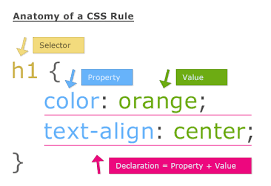
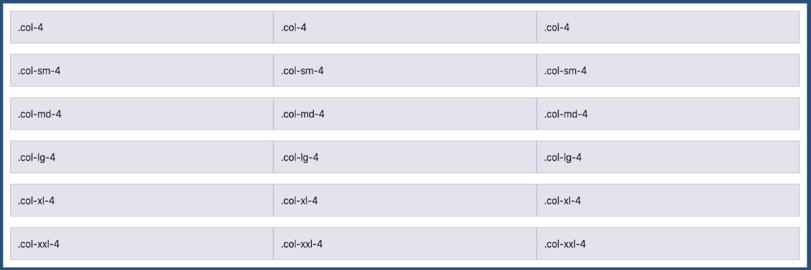

## Getting Started

In this lesson, we will be using advanced CSS, or Cascading Style Sheets, to make your projects more visually pleasing.
To begin, let’s open a project with HTML/JS code in a code editor. We’ll be using repl.it as our editor, as changes are seen immediately with this environment.

## Review

We’ll assume that you have used our intro to CSS tutorial to understand the basics of visual design in web development. For a quick review, here is a diagram of a CSS stylesheet.


## Bootstrap

We are going to be exploring Bootstrap, a CSS framework that makes the creation of layouts much simpler. It does this by using classes to replace custom CSS code, making the process of representing graphics over multiple screen sizes (like desktop, tablet, and mobile) much simpler.

To install Bootstrap, go to this website, and copy the two tags under CDN via jsDelivr to add them to your HTML code (Hint: use the copy button in the top right corner). This process is called importing, which “imports” the code in the library into your code, allowing to be used as CSS classes.

How does it work? Well, Bootstrap contains CSS files, like any other website. But, before we can use this CSS, we are using a link tag to access this code from a file with styled classes. It applies classes to HTML classes in place of rewriting CSS code, thus speeding up development and efficiency of your coding process.

## Grid System

Grid systems allow for the efficient placement of HTML elements. In bootstrap, there are 12 column units. (So if you want a column to take up half the screen, you would use 6 units) To set the column grid, just set the class attribute to `col-[units]`. Rows can also be used to separate columns. An example is provided below for your reference.



## Forms

Forms are an integral part of any website, or other web-based program, as they allow for data to be collected from the user. Hopefully, you know how to use forms by now, but here’s a quick refresher.

Using Bootstrap, we can enable form features with the class form-control.

```html
<input class="form-control form-control-sm" type="text" />
```

We can easily size elements of forms setting the class `form-control-[size]`. There are multiple available sizes here, such as `lg` for large, `sm` for small, and nothing for normal sizing.

```html
<select class="form-control form-control-lg">
  <option>Large option</option>
</select>
<select class="form-control form-control-sm">
  <option>Small select</option>
</select>
```

We can display elements on the same line using the inline class.

It is considered good practice among web developers to group form elements, as it provides structures to forms. Bootstrap allows for this by the use of the form-group class. This is particularly useful when there are several groups. Try out the code in the example below. What if we had many of these questions for different forms, and we didn’t group them? That would be hard to keep track of for sure!

```html
<form>
  <div class="form-group">
    <input type="text" class="form-control" placeholder="Input 1" />
  </div>
  <div class="form-group">
    <input type="text" class="form-control" placeholder="Input 2" />
  </div>
</form>
```
