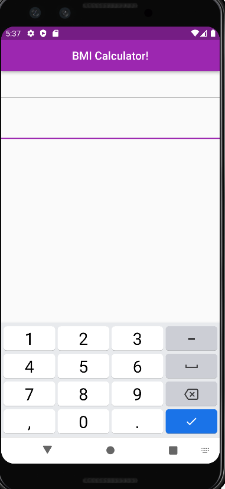

## Intro

Hello, in this article, you will be learning how to create a BMI calculating mobile app in Flutter. We will assume you have Flutter installed.

If it is not installed follow along with these videos in this order for windows: <https://www.youtube.com/watch?v=Z2ugnpCQuyw>,<https://www.youtube.com/watch?v=8YlJ9RjdpkA&list=PLSzsOkUDsvdtl3Pw48-R8lcK2oYkk40cm&index=5>, and <https://www.youtube.com/watch?v=n9qDNVoe5V8&list=PLSzsOkUDsvdtl3Pw48-R8lcK2oYkk40cm&index=6>.

If you are on a mac, follow along with these three videos in this order: <https://www.youtube.com/watch?v=hL7pkX1Pfko&list=PLSzsOkUDsvdtl3Pw48-R8lcK2oYkk40cm&index=7>,<https://www.youtube.com/watch?v=gv1LScpG0jM&list=PLSzsOkUDsvdtl3Pw48-R8lcK2oYkk40cm&index=8>, and <https://www.youtube.com/watch?v=_p3VbxiVuRU&list=PLSzsOkUDsvdtl3Pw48-R8lcK2oYkk40cm&index=9>.

After that, create a new flutter project in your IDE! (Should be included in the videos).

## What is Flutter?

Flutter is a cross-platform UI development kit that is also cross platform! It is developed and maintained by Google, but it is open-source. It is typically used for Mobile development on iOS and Android, but it has spread to desktop and web as well. Flutter is built on a C++ engine which makes it extremely fast. To program your own Flutter project, you need to use Dart, which is a well loved language that is developed and maintained by Google. Dart is very similar to Javascript which makes it very easy to use and learn.

## What is BMI?

BMI stands for Body Mass Index. It is used to measure fat levels using weight and height. The formula for BMI is weight divided by height squared times 703 if you are using pounds and inches.

## Getting Started

Above is an image of our default app that Flutter creates for us. If we click the button, the number should go up by one. Let's take a look at some base code.

Here we can see that there is a Material App by default that has a title of “Flutter Demo”. For our theme, we can see that we have a ThemeData Widget. The parameter in Theme data is the main color we want for our app. Now let’s change Colors.blue to Colors.purple.

As you can see, everything that was blue has turned purple all with one small change. However, on the top right, you should see this banner telling us that we are in debug mode.

This may get annoying after a while so let's get rid of it. To do this, in the MaterialApp Widget, simply add one small parameter, debugShowCheckedModeBanner and set it to false.

We are telling Flutter that we want a Material App that has does not have a debug banner. The home parameter states that we should have a homepage that is a MyHomePage custom widget. After that minor change, we can see that the banner is gone.

If we scroll down, we should see the rest of the app.

If we go down to the MyHomePage, which is a custom widget.

Delete everything in the Widget Build function:

You may have noticed that the MyHomePage widget is a function. Everything visible in a flutter app is a widget. From Appbars to images, nearly everything in Flutter is a widget. Developers can also create custom widgets like the MyHomePage widget.

## Stateful vs Stateless Widgets

Stateful widgets are widgets that can change properties in the future. This could be used for a timer app. The numbers on the timer must change, so therefore the widget must be stateful. Stateless widgets are for widgets that do not change state. This could be used for a block of text that displays a hardcoded message.

## Creating the Calculator

In the MyHomePage function, we want to return a widget that the user can see. What should this widget be? Well in a Material App, the basics of a Mobile App screen is what is known as a Scaffold widget. This provides the basic structure to our screen, where we can add more properties such as Appbars, floating action buttons, and more. So, return a Scaffold() widget to the build method.

If we check our emulator now, we should see a blank screen on our app.

On this scaffold, we want to add an Appbar to the top of our app. How do we do this? We need to add an Appbar widget to our scaffold. Flutter provides the Appbar as a widget for Material Design. So, in our Scaffold, add an appbar as a parameter.

Upon doing this, we can see that our screen updates to have a blank appbar like this:

However, we also want to add a title to our appbar. To do this, we have to add a Text Widget in our appbar.

We also set centerTitle to be true. This will put our title in the middle of our appbar like this:

Now let’s add something to the body of our app. In our app, we want to be able to enter in a certain amount of numbers for our weight and height. So let’s add two text field widgets in our app. Add a body property to our scaffold and put a Column widget in it. In the column widget, we can stack items under and over each other in our app. Those items have to go in the children property in the Column. In our case, those items will be the TextField() widgets. However, we want our text fields to have numbers in them, not letters. Thus, we have to make the keyBoardType to be TextInputType.number. Remember that in a column widget, the childrens property accepts a list so the items have to separated by commas.

After doing that, our app should look like this:

If you click on the fields, a number pad should show up where you can add your width and height. However, to actually calculate those, we have to store the values of the fields in a variable.

## Widget Lifecycles in Flutter

In Flutter, there are ints, strings, bools, and more just like in most programming languages. However, to actually change or update those values, you can’t just set it equal to whatever you want like in most languages with an equal sign. You have to wrap it in the setState function. This function calls the Widget build method we saw earlier again. So whenever we want to update the state of something in Flutter, we have to wrap the action in the setState method. In our situation, we want to update the value of the width and height every time the user changes the values of the fields. To check whether or not the values of the fields have changed we have to use the onChanged method of the TextField which runs every time the Textfield changes. In that function, we want to get the current value of the field and make it the overall value of our width and height. Remember, in order to actually update this, we need to wrap it in the setState function.

1. Add the variables width and height outside the build method.

   

2. Next, change the values of the fields!

   

## Creating the calculations

Under the int variables, we need a Double that stores our actual BMI. Now that we have the numbers, let’s create a button that actually calculates the BMI for us when we click it. In our column widget, add a SizedBox with a height of 25.0 so that we have some space between the fields and the button. After we do that, add a TextButton() widget and make the child property to be a Text widget that tells you to calculate BMI. The onPressed function will be fired when the user clicks on the button. Thus, it accepts a function. We want the onPressed function to update the BMI double. Of course, to do this, we need to wrap it in the setState function. Remember our formula to the BMI above. We need to use a special dart function called “pow” to get the square of our height. We must divide that number by the width and multiply all that by 703.

However, now we want to display our BMI on our app. We do this by creating a Text widget under the calculate button in our Column. We can parse ints to strings in dart by using the $ sign. After we get our overall BMI, we can put that into the text widget and display a message after it like so:

Now if we check out our app, we should be able to enter in our height and weight and get our BMI!

Thanks so much for checking out this article!
