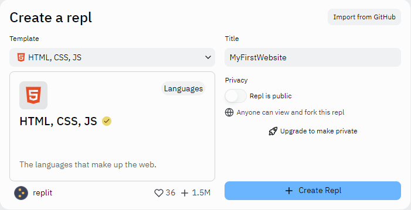
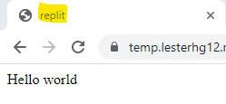

## Getting Started

In this lesson, we will be working on HTML, Hypertext Markup Language, and CSS, Cascading Style Sheets, to make your own website.

First of all, it is recommended to get a code editor. In this case, I will use [Repl.it](https://repl.it) since it lets you see your changes instantly. If you decide to use it, go to [https://repl.it/languages/html](https://repl.it/languages/html).



After choosing a code editor, we are now ready to start!

## Adding Content

After opening your code editor of choice and creating a new project or repl, you will see auto-generated code. It is your choice to whether delete it or not.

If you open and run the code generated by repl.it, you will see something similar to this:


You may be wondering what all these words mean, so I'll give a short explanation on each thing.

Before starting, it is important to note that sometimes the letters in blue repeat themselves with a `/` added to them. For example `<html>` and `</html>`. This is because the `<>`, or opening tag, says and sets the attributes of an element, while the 2nd `</>` (notice the dash) decides when the element will close.

Now let's explain the meaning of some tags. The first line, `<!DOCTYPE html>` tells the web browser what type of document, and version, it is receiving. This is will appear at the beginning of every website. The next line, `<html>` is what wraps around every other tag, all websites also have this. The `<head>` tag is where the style, the title of the website, and other data is stored. I'll skip around to the `<title>` tag, which writes the title of the website in the page's tab.



Now, the `<body>` tag is where all of our content will be. This is where pictures, text, and buttons are mostly located. Finally, the `<script>` tag is what is used to refer to code, mostly JavaScript, but we will not use it in this tutorial, so we can get rid of it.

If you want to learn about more tags, I recommend going to [w3schools](https://w3schools.com).

## Running the code

Repl.it let's you run your code as easy as clicking **Run** or clicking on the upper right button that says "Open in a new tag". This will be important since we need to make sure the page is changing as we desire.


Time to add some code!

## Adding more content

There are many tags that can be used to add text. Ranging from lists (`<ol>` and `<ul>`) to headings (`<h1>` to `<h6>`) 1 being the most important and 6 being the least important. You can also add text using the standard paragraph (`<p>`) tag.

Let's make a simple website explaining what to include in a website. So first we'll need a title. Since it is the most important part, we will write an `<h1>` tag between the body tag. We will write the title in between the `<h1>` tag and call it "Things To Include In a Website":

```html
<!DOCTYPE html>
<html>
  <head>
    <meta charset="utf-8" />
    <meta name="viewport" content="width=device-width" />
    <title>replit</title>
    <link href="style.css" rel="stylesheet" type="text/css" />
  </head>
  <body>
    <h1>Things To Include In a Website</h1>
  </body>
</html>
```

Now we'll add a numbered list using the `<ol>` tag. In order to add a new item in the list we have to surround it with `<li>` and `</li>`. We'll add some of the things we might include on a website such as: Attractive Title, Pictures, Text, Lists, Buttons, and a Navigation Bar.

```html
<!DOCTYPE html>
<html>
  <head>
    <meta charset="utf-8" />
    <meta name="viewport" content="width=device-width" />
    <title>replit</title>
    <link href="style.css" rel="stylesheet" type="text/css" />
  </head>
  <body>
    <h1>Things To Include In a Website</h1>
    <ol>
      <li>Attractive Title</li>
      <li>Pictures</li>
      <li>Text</li>
      <li>Lists</li>
      <li>Buttons</li>
      <li>Navigation Bar</li>
    </ol>
  </body>
</html>
```

Now, we need to clarify what some of these things mean, so we'll have to add descriptions in between `<p>` and `</p>`. Remember to place them below each `<li>` tag. After adding the text, your code should look something like this (don't worry too much about what the descriptions say):

```html
<!DOCTYPE html>
<html>
  <head>
    <meta charset="utf-8" />
    <meta name="viewport" content="width=device-width" />
    <title>replit</title>
    <link href="style.css" rel="stylesheet" type="text/css" />
  </head>
  <body>
    <h1>Things To Include In a Website</h1>
    <ol>
      <li>Attractive Title</li>
      <p>
        It is impotant to write a meaningful and attractive title since it helps
        convey the main idea of what it will talk about. This helps the reader
        get an idea of what the topic is going to be about before they start
        reading. Lastly, if the title is attractive enough, more people will
        want to visit the website.
      </p>
      <li>Pictures</li>
      <li>Text</li>
      <li>Lists</li>
      <li>Buttons</li>
      <li>Navigation Bar</li>
    </ol>
  </body>
</html>
```

Now, we may want to start adding some pictures so it's not all black and white. But as of now, the website should look something like this:


## Adding pics

Let's make the website a little more interesting with some pictures.
For this, we will need the `` tag. And this is an exception to the "openning/closing tag" rule since we don't need to close it with `</img>`
Now, if you try to add the `` by itself, you may notice that nothing is happening. And well, that's because it needs to know which picture it is going to use. So we're going to write `` below each paragraph, which will look something like this:

```html
<li></li>
<p>
  It is impotant to write a meaningful and attractive title since it helps
  convey the main idea of what it will talk about. This helps the reader get an
  idea of what the topic is going to be about before they start reading. Lastly,
  if the title is attractive enough, more people will want to visit the website.
</p>

```

Note: If you decide to upload images, make sure to put them inside of a folder to make it easier to access them.
After adding all our pics, our website now has all of its content.


Now hold on. We're still not done. Although we have the content, we still need to make the website look nice. For this, we will need to use CSS.

## Styling with CSS

Don't like how the picture isn't centered or would like to make each point larger? These are some things that CSS will help you change.

If you are using repl.it, you make have noticed that on the left there is a file named "style.css". This is where we will work on. Or if you are using a different code editor then create a new CSS file.

Now we'll add the CSS file into our HTML file. You may have noticed, but there was no mention of what the 7th line of the code does. The tag is `<link href="style.css" rel="stylesheet" type="text/css"/>`, so let's break it down.
So first of all, the link tag connects the link we give to the HTML file. Where do we write the link? The link is written in the href="link", href standing for hypertext reference. Next, rel="stylesheet" defines the relationship between the HTML file and the link, which in this case is a "Style Sheet" or a file that gives style to the page making it look nice. Finally, there is type="text/css" which indicates that the content is a CSS file. (Notice that the "/" before the ">" is optional just like in the image tag).


Now let's go inside the CSS file!

Let's start with centering the images. So first of all, we need to write the type of element we are going to change, so in this case we would write `img{ }`. Notice that this changes all of our images.

Now that we have this done, we will start changing the properties of the images. So let's write `display: block;` inside the "{ }". What this basically does is make it so that nothing can be added to the right of it and lets us center it. Now let's add `max-width: 100%;` and this is important since it let's the image retain its best resolution by not letting it enlarge more than its original size.

Finally comes the centering. To center it, we are going to use margin. Margin is helpful when wanting to separate elements. We are going to write `margin: 0 auto 15px auto;` letting "0" be the margin at the top, "auto" meaning that the page should adjust the margin to make it fit the proportions set, in other words this is what aligns our page! The 15px are there to separate the images with the title of each item, making it look better.
After putting all that in, our code should look like this:

```css
img {
  display: block;
  max-width: 100%;
  margin: 0 auto 15px auto;
}
```

Now time to change some of our text.
We can change the text by using the tag name. In this case, I will change each list item, "li", and will set its color to green, the font size to 22px, and I will change the font to "Franklin Gothic Medium" (font-family):

```css
li {
  color: green;
  font-size: 22px;
  font-family: "Franklin Gothic Medium";
}
```

## Finishing Touches

If you want, you can add more things to your website or you can style it differently to make it look nicer! All that is left for you is to finish it and share it with your friends or family. If you logged in on repl.it you will be able to see the link of the website and you can share this with anyone.


## THANK YOU!

If you finished reading this tutorial, thank you for your time!
Here is a link of the tutorial as a website if you want to take a look at it:
[Things To Include In a Website](https://temp.lesterhg12.repl.co/)
