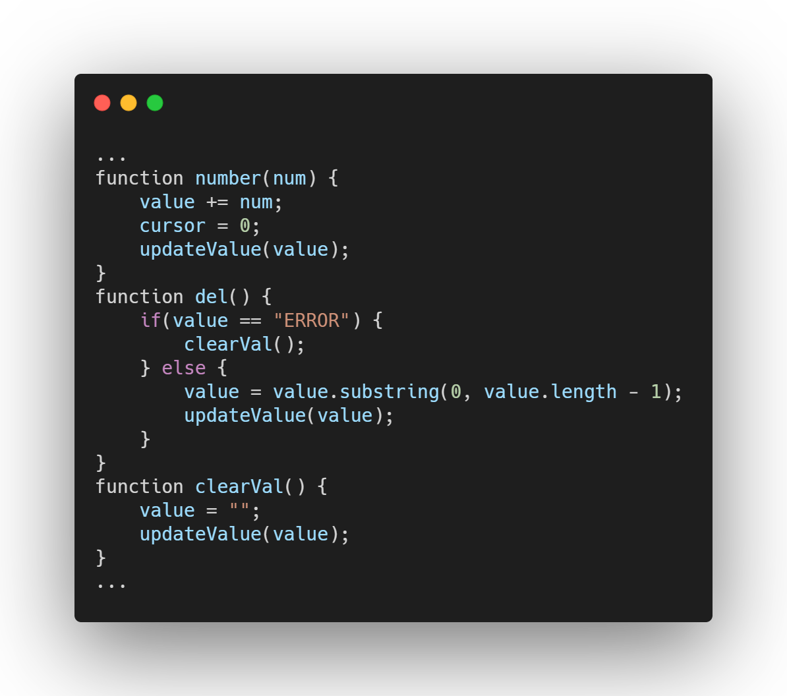

## Introduction

This tutorial will allow you to utilize HTML, CSS, and JS to create a working calculator with a UI. You will create a functioning webpage that with a calculator that will be able to perform basic arithmetic operations, clear numbers and answers, as well as use decimals.

## Getting started

Create a new folder for this project. Then, go to [this](https://raw.githubusercontent.com/App-Dev-League/curriculum-hub-webdev/main/week4-project/Calculator.ttf) link and download the font file for the calculator. Save this file as Calculator.ttf. Next, create a new file called index.html. Make sure to link the stylesheet (style.css) that we will make in a while. Your file should look like the one below.

Now, create a body and calculator div, then add a `<h1>` header for the current calculator text.

## Building the basic structure (HTML)

Create a new div to store all of the buttons in the calculator (a sample layout is shown here with 4 buttons on each line). Make sure to use ` ` to separate lines. It is also imperative that each button should have its own id (button-symbol). In addition, it should have two classes: Calculator-button for styling every button and a specific class for styling certain types of buttons (i.e. Calculator-number for numbers, Calculator-operation for operations, Calculator-extra for everything else). Sample code for this section is given below for reference.

## Incorporating JS into HTML

Below all the elements, add a `<script>` tag, which will hold all the JS for the project.

Create empty functions, which will be called by button clicks, with the onclick tag to ensure they will be called when the buttons are clicked.

## JS

Create a global variable “value” to store current numbers on the calculator, and a global variable “cursor” to store the position of the cursor as well. Make sure to place these in the script tag.

Here are the functions that need to be defined using these values:

- Function number takes in a number / symbol and updates the value
- Function del deletes item right before cursor
- Function clearVal clears the value
- Function front moves cursor up by one
- Function back moves cursor back by one
- Function updateVal takes value variable and formats it and puts it in the calculator header

Sample code for these functions is provided below.

Next, we need a function to calculate the value of the calculator. Use the eval expression to allow the console to evaluate the current calculator expression.

After this, we need to make keys change the calculator state. To do this, create a function keyHandler(e) with a single argument, where e.key represents the key name. To bind the function to the document, use the following line of code: document.addEventListener('keyup', keyHandler);

We now need to create a dictionary called keys in order to map each key to its appropriate method. Every button has an id: `button-useofbutton`. The keyHandler should first get the key, then check which `useofbutton` it corresponds to using the keys dictionary, and click that button.

Finally, connect the event listener using the line: `document.addEventListener('keyup', keyHandler);`

## CSS with HTML

Create a new file called style.css. The link element in the HTML code will link to this file. The CSS for this project will mainly add styling for the header and elements, and apply the calculator font.

## CSS

Connect the font to the project using the following code:

Use the following CSS selectors (left) to select right elements, and add appropriate styling to make the calculator look beautiful. Use html and body selectors to select those two elements. background-color sets the background color, width and height are self explanatory, font-family determines which font family is to be used, margin and padding define the distance between an element and other elements, and overflow says to hide text if it becomes too big to fit in the element.

To style the calculator class, use the .calculator selector. box-shadow gives some shadow around the calculator. width and height use the calc CSS method to make them 30 px less than the full width and height, making them more visually appealing. max-width and max-height ensure that the calculator can only expand a certain amount, while position:absolute ensures that it stays in the same place even when other elements move. left and top push the top right corner of the element to the middle, and transform centers the image after this.

Also consider using width and height to ensure that the header and/or body don’t cover the entire screen (above right). For the “value” or number entered into the calculator, use absolute positioning and centering to create a more completed look. @media makes CSS run only under certain conditions (in the example below, when the max-width is 400px).

For the buttons, border is particularly useful as it sets a border around the element, font-family sets the font, transition allows for box-shadow to slowly grow and shrink when a button is clicked, cursor changes the cursor type. calculator-button:focus/active change the button CSS depending on whether it is the focused or active element.

Adding different colors for different operations also ties the calculator together.

Conclusion
That completes this tutorial on how to build a calculator from scratch using HTML/CSS/JS. Example code for reference can be found [here](https://github.com/App-Dev-League/curriculum-hub-webdev/tree/main/week4-project).
