## What is JS

JavaScript is the leading programming language for web development. It allows you to change both HTML and CSS code, while also having the capability of working alongside servers in the calculation and manipulation of data.
Some of the benefits of using JS include: being accessible in all platforms, easy to work on, and efficient to use.
Now that we know a little bit more about JS, let's get started.

### Practicing

In the last tutorial, we made a website on Repl.it. We will only need a temporal website, so the website from last time works, but we will not make any changes to it. We will simply practice using it.
First, you will need to add the line `` before the closing `</body>`. Make sure that you have a JS file named "script" in your project.

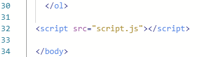

To make sure that your js file is linked correctly to your website, write "alert("Hello world");" in the JavaScript file. If you run it again and see the message, then good job!

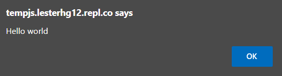

## Variables

Unlike other languages, JS does not require you to specify the type of variable. Instead, by writing "var", "let", or "const" you declare variables. The differences?
Var: When writing a new "var" inside of a function, the variable can only be called inside of the function. While if a new "var" variable created outisde of a function can be changed and called inside of a function. If there are two "var" variables declared with the same name, one inside of a function and another outside, the value of the variable will change depending of the last value set equal to it.
Let: Similar to "var", if you create a new "let" inside of a function you cannot call it outside of it. However, unlike "var", if you create a "let" variable outside of a function, you cannot call it inside. This prevents any unwanted changes to your variables. Also, you can create and declare two new "let" variables, one inside and another outside of a function,both values will be retained and can be used depending on where you call it.
Const: "const" variables are the same as a "let" variable. The only difference is that while "let" variables can be changed, "const" variables stay constant and therefore cannot be modified after their creation.
If you want to check it out, www.w3schools.com provides a more visual example of their differences.

## Strings, nums, and bools

We learned how to create an instance of a variable. If you have experience with other languages then you may have noticed that the type of the variable has not been defined. And this is because JavaScript defines the type of variable when creating the variable.

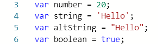

These are the three basic types of variables. Notice that we can write strings with either " " or ' '.
Note: you cannot redeclare "let" and you cannot change a "const" variable.

## Creating an onject

Creating an object is relatively easy. The steps to making one are very similar to those of making a variable, but we will use brakets "{}", colons ":" and commas "," to separate each value inside the object.

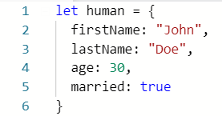

And if you want to access a value inside of the object, you just write the name of the object, put a "." and write the name of the value you want to access.

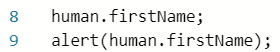

You can even add functions inside of an object. Creating a function inside an object is very similar to creating a new attribute of the object. You first write the name of the function followed by a colon ":" and the keyword "function", then parentheses filled with the parameters you will access that are outside of the object, write the code, and finally return the result with a return statement or simply just perform an action.

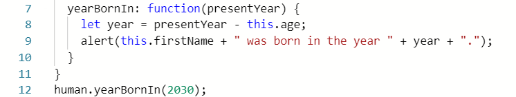

The above code returns the following pop-up.

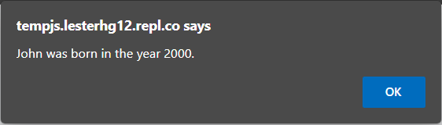

## Creating a class

Sometimes you want to create many different people, and you will find creating a new object each time you create one very time consuming. Classes are templates that create objects quickly. Let's see what the following code does.

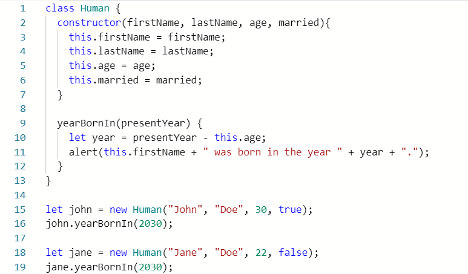

You may notice that there is something called "constructor" with attributes in parantheses. What the constructor does is set the attributes of an object from the "Human" class from an outside call (line 15). You may also notice that functions are created differently then inside objects. In here you just need the name of the function, parentheses "()" with attributes inside them, and the actions surrounded by brackets "{}".
To create a new object, you will create a new variable and name it, then write the keyword "new" followed by the name of the class (case-sensitive) and the values set to create the class.
Lastly, functions are called by writing the name of the variable, followed by a dot and the function with parentheses.
The code should show two pop-ups. One showing the year John was born, and another showing the year Jane was born.

## More logic

There are functions, for/while loops, if/else statements, and arrays to cover. Let's start with functions.
We have previously seen how to create functions inside a class and object. Creating one outside of them is very similar to these. We just have to write the keyword "function" followed by the name of the function, the parentheses with parameters inside, the curly "{}" brackets and the logic inside the brackets.

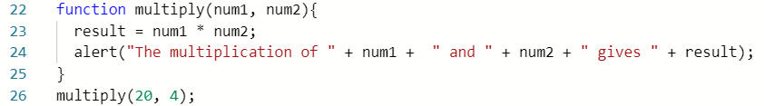

Next come loops.
There are two types of loops. While loops and for loops. While loops are written when you don't know when the code will end. For example the number of restarts in a game. The following is an example of a while loop.

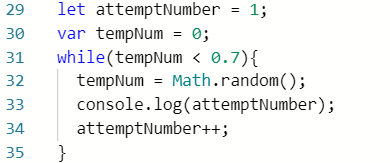

As we can see, the while loop has the keyword "while", a true or false statement inside the parentheses, and code some type of logic in the inside.
"For" loops work similarly. But we write the keyword "for" and in the parentheses we declare an integer, set a limit, and change it. See the following:

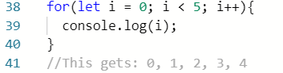

"If" statements are very similar to "while" loops. The only difference is that if statements do not occur more than once unless through a loop.

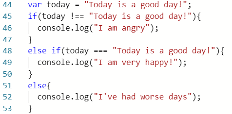

If first "if" statement is false, it goes to the "else if" statement and runs the code inside it. Otherwise, if the second statement is also false, then it goes to the "else" statement and runs the code inside of it.
Note: unlike other languages, you DO have to write 3 "=" signs when comparing variables, otherwise you may run into an error.
Lastly we have arrays. Arrays mean a collection of objects. And unlike other languages, it is not set to only one type of object. There can be numbers, booleans, strings, and objects inside of an array at the same time.
We can make an array and access some of its attributes the following way:

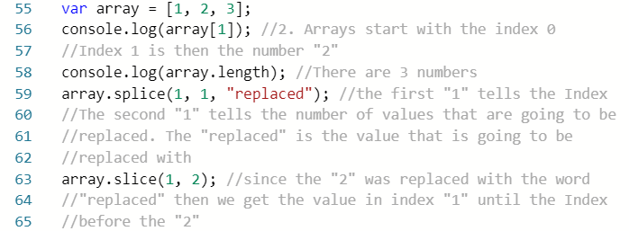

## Thank you!

If you finished reading this tutorial, thank you for your time!
If you feel like you need more practice with any of the stuff in here, you can always go to <https://www.w3schools.com>

Here is a link of the tutorial as a website if you want to take a look at it:
[Intro To JS](https://lesterhg12.repl.co)
