<!-- @format -->

## What is Node?

Node.js is a software development tool that allows you to write JavaScript on many platforms. It is mainly used in backend development, or in other words, servers.

## Why use node?

In addition to making writing JavaScript code easier, Node has pre-built modules on its library, minimizing the need to make new classes and functions. On top of this, there are no threads in Node, meaning that you will be able to work in parallel or asynchronously, or more simply let the user perform multiple actions on the website at the same time. Finally, it has a debugger and other tools which could aid you while coding.
Node is the most popular JavaScript runtime available. Its amazing features and capabilities are useful when working with JavaScript frameworks such as React, Express, Angular and more.

## Examples of Node.js frameworks

One of the most popular frameworks on Node is ExpressJS. It is used for designing and building web applications. It is part of a javascript based technology called MEAN (MongoDB, ExpressJS, AngularJS, and NodeJS), and ExpressJS is the backend part of MEAN, managing routing, sessions, error handlings, HTTP requests, etc.
Code on Replit:
To use Express in Repl.it, you need to go to “Packages” (the cube) and type “Express”.

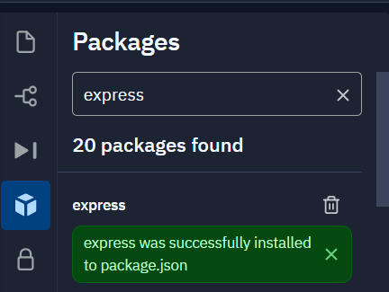

After installing, you will also see that some text appeared on your console indicating that it was correctly implemented.

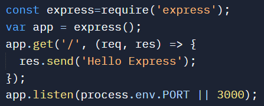

A basic example of how it could be used.
Another less known example of a framework is “Progress”. It allows the user to see the progress of heavy operations when the computer is doing heavy tasks. It comes with a lot of information regarding the completion of the process, and there is a lot of other data you could include in it. This framework works thanks to Node being asynchronous and being able to handle many tasks at once.
Similar to Express, to import it on Repl.it you need to go to “Packages” (the cube), type “Progress” and click on it to download and import it.

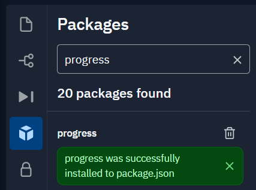

This is an example of what you can do with progress.

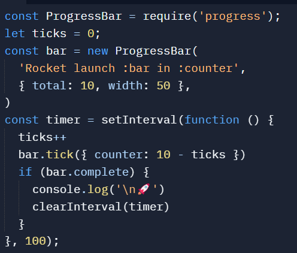

Try it out and see what it does 😉.
Now that you understand the importance of learning JavaScript and node, let’s get to it!
To get ready to start, head to replit.com and create a new repl.

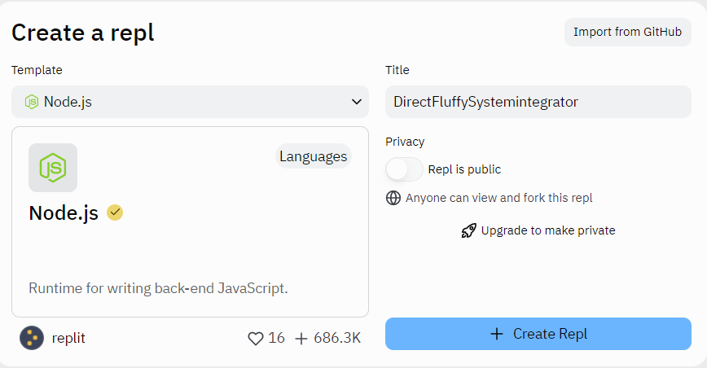

## Setting it up

After creating the repl, you will see something like this:

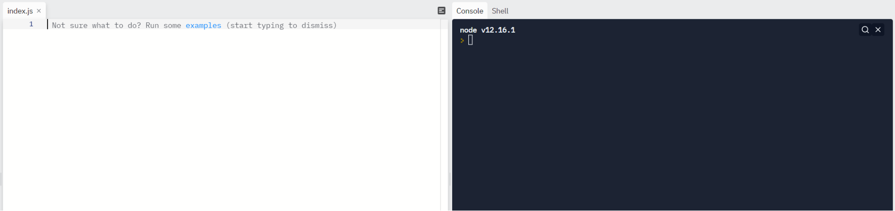

To make sure it is working properly, type "(async (a = 1, ...b) => ({ ...b, a, [a]: `${a}` }))()". You can paste by right clicking. You should see something similar to the following.

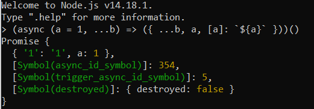

If you have no problems with Node, then it's time to start!
Note: It is recommended to have some prior knowledge of JavaScript. Here is a link of a tutorial in case you need one. Intro To JS (lesterhg12.repl.co)

## Tab

One of the most useful tools Node has includes the “tab” key.
Sometimes you may notice an auto-fill suggestion if you are working on the console. As an example, try typing “Array”. You will notice that there the word “Array” is shown before finishing typing it.

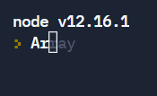

You can press “tab” and the word you are typing will be autocompleted.

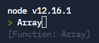

You can also look at the functions or properties of a class or variable if you write a “.” and double “tab”.

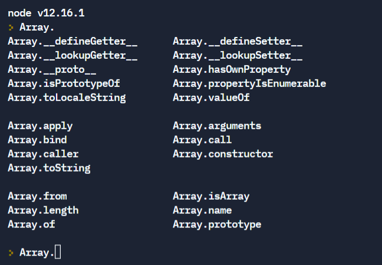

If you are curious and want to know all of the libraries that JavaScript includes by default, you can double “tab” on an empty line to get a list of them.

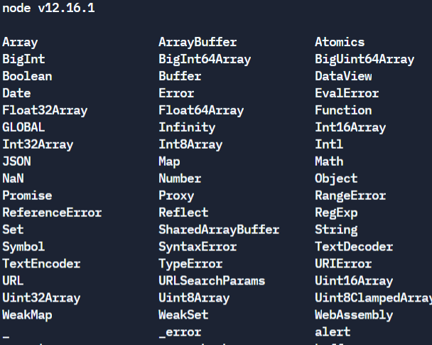

Fun fact: The underscore “\_” you see on the bottom left can be used to call for a previous variable. It is useful when you want to store the result of a previous operation that is not defined.

## Running Scripts

One way of running the code is by using “Shell”. “Shell” will run the script and will exit as soon as no running tasks are found.
We will write “Console.log(“Hello”);” in the index file. Then, we will type “node index.js” on the “Shell” to run the script. This will print “Hello” right under it.

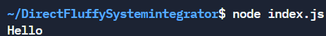

It is good to know that “Shell” can execute our code and run a server if you go to “localhost:numberGiven”, however, repl.it allows us to run it in easily by clicking on the green button or opening a new tab, so we will instead use that.

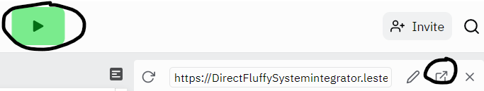

If you decide to open a new tab, you will need to reload the page every time to see changes, and you will not be able to see messages from the console.

## Process Functions

One way to print text in the console is by using the “console.log” function. However, there is an alternative to this. The function “process.stdout.write” works the same way. You can test them out and you will notice they’re the same. This is because they are both writing to the stdout stream in the console.

However, there is another important function the object “Process” has. This is “process.stdin.in”. This function lets you read information from users. To learn more about them, you can go to the official Node page nodejs.dev

## Timers

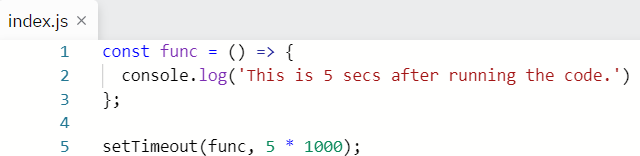

So, we first create a function called “func”. This function sends a message to the console. Then, “setTimeout” calls the function after 5\* 1000 milliseconds, where 1 second = 1000 milliseconds.
Sometimes, we need to pass an argument to the function we’re calling. We can write this after the set time.
As an example we have the following code:

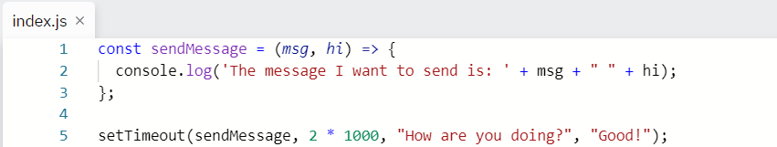

We see that this block contains variables inside of the parentheses in line 1, and they are used on line 2. The values of the variables are set on line 5, right after the time is set, and they are separated by commas.
Now, what if you want to repeat an action every 3 seconds? We can use the “setInterval” function.

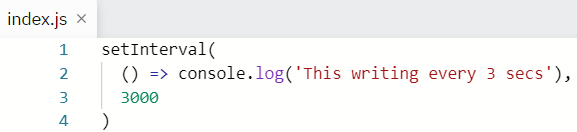

This will print a message every 3 secs (as set in the 3rd line). It will not stop until we exit the process. (You can exit it by pressing ctrl + C twice).
We can cancel a timeout with the function “clearTimeout”, and similarly we can clear an interval with “clearInterval”.

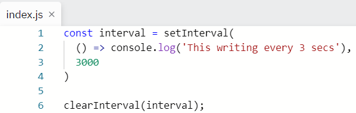

Since the interval is being cleared, nothing will be written.
Note: Timeouts run after everything else has been executed. So if you have a very lengthy and slow method, the timeout will not run until after this method is finished.

## Website

If you made it this far, this is a preview of making a website!

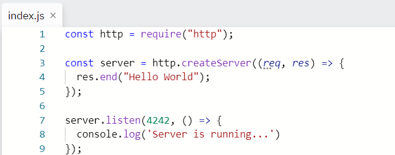

Let’s break it down.

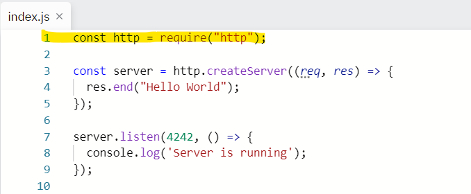

It starts with the “require” function. Used when calling for libraries. There are alternatives, but we will use it since it is built in.

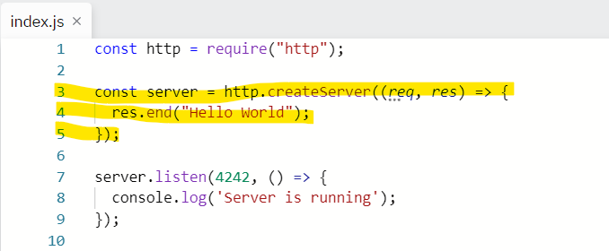

Then comes the web server. This accepts a “request listener”, called each time the server gets a request. Then there is a “response object”, which is used to write things to the requester. As you can see, the “res” or “response object” is writing “Hello World” on the page. The “.end” method is a shortcut used to write data and end the process quickly.

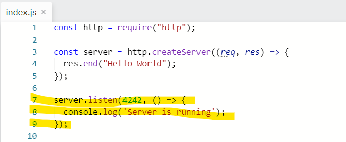

We have created the server, but it is not active. Activating it is part of line 7. The method also includes the port number the server is going to run, which in this case is “4242”. This port number can be used to run the code on a browser, by typing it in the format: “localhost:numberGiven”, or “localhost:4242” in this case. The “console.log” method inside will run once the server is running.

## Examples

Here are some examples of projects made with node:
[Slack Todo List – Hack Club](https://workshops.hackclub.com/slack_todo_list/)
[CLI App – Hack Club](https://workshops.hackclub.com/cli_app_with_nodejs/)
[Kahoot Clone — Kuizzy – Hack Club](https://workshops.hackclub.com/kuizzy/)

## Thank you!

If you finished reading this tutorial, thank you for your time!
If you have stayed this far, there is a world out there to explore with node!

