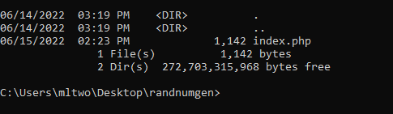
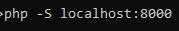
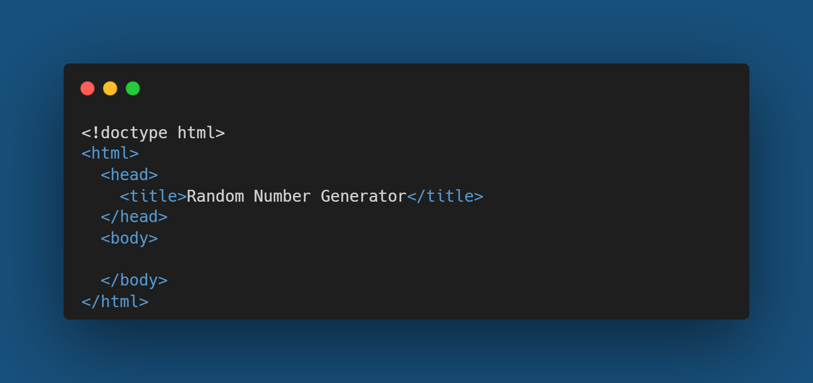
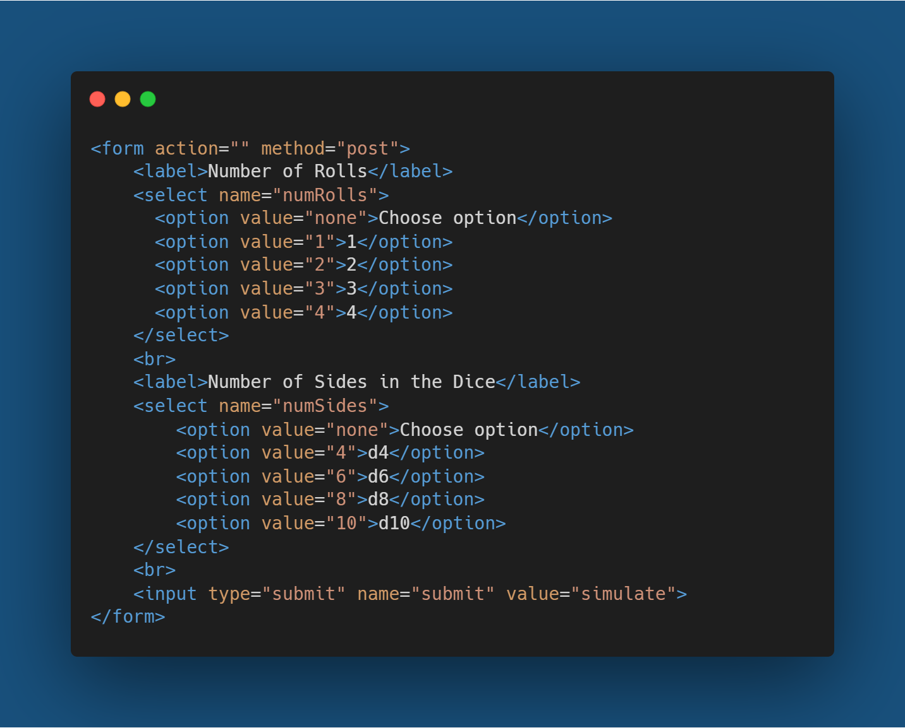
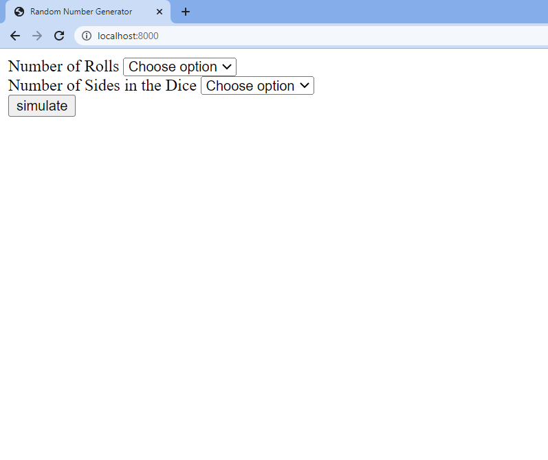
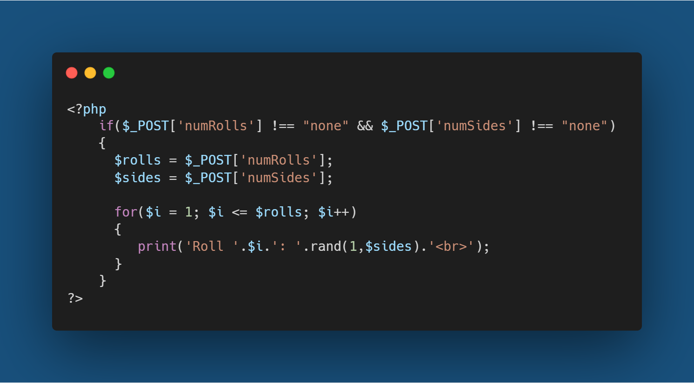
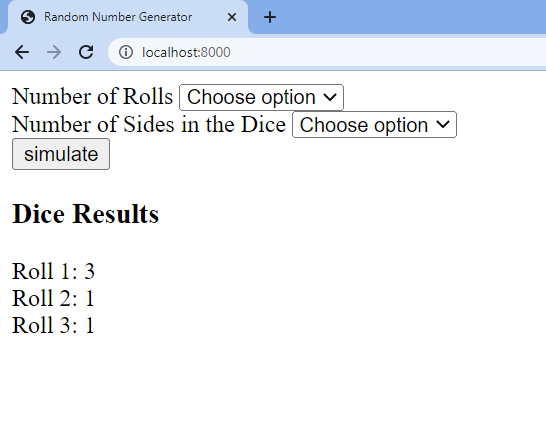

## Intro

This article will be a walkthrough of how to create a simple web app for a random number generator. The app will allow users to choose the number of dice rolls and the number of sides of the dice, after which it will generate and display random rolls.

## Tools

- HTML
- PHP

## Getting Started

Create an index.php file in a directory of choice as shown below:

Make sure php can be run from the command line; the following command should create a new session on localhost port 8000. Run this in the same directory as the index.php file.

Afterwards, open up a new tab in a browser and type localhost:8000 which should allow access to the webpage on the same/local device.

If this doesn’t work and “php” isn’t recognized by the command line, then PHP needs to be installed and added to PATH in the environmental variables. PHP downloads can be found at <https://windows.php.net/download/>

## Creating the App

Start with an HTML template with the basic elements as shown below:

Add a form for the user to submit data with the method as “post”, which will allow the form to submit any data using the POST request to be processed by the PHP server.
Within the form, options can be added using the select and option tags to allow the user to pick the number of rolls and the number of sides the dice have. In addition, add a submit button using either the button or the input tag to allow the user to submit their choices.

The result should show a simple, unformatted webpage as like this:

Lastly, insert PHP code using the php tags and first check whether the form data has been filled. If the name attribute for the number of rolls option was ‘numRolls’, the value can be accessed with $\_POST[‘numRolls’].
If both options have been selected by the user (i.e. both options have a value that is not “none”), then generate and display the simulated dice rolls. The code below uses a for loop over the amount of rolls, and for each iteration, it will print out a random integer value from 1 to the number of sides (inclusive).

The final result should look like this when the user submits their chosen options:

## Conclusion

Although the web app has little formatting, CSS and other styling can be added to make the webpage look better; hopefully this tutorial has demonstrated a basic use of php to process data from a form.
