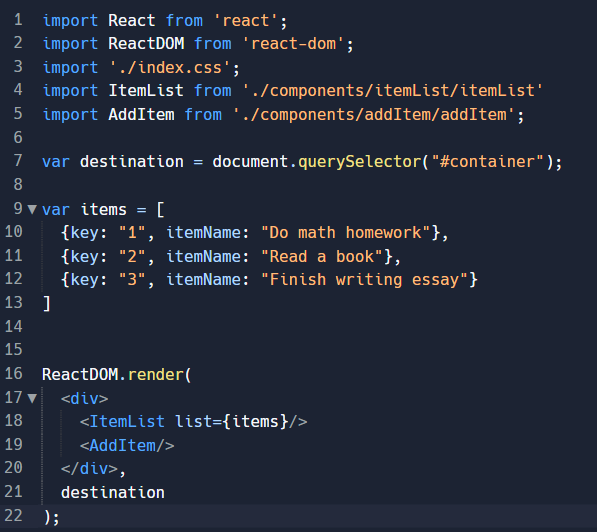

## To-do App with React

Let’s build a To-Do list App to get a basic idea of the things that can be built with React.
As an intro, let’s start with explaining what React is. React is a Java-Script front-end language developed by Facebook. React makes it easier to update the Web App after interacting with the user. It also allows HTML code to be reused, simplifying the code.
It is important to note that we won’t be working with servers, which means the to-do list will reset after reloading the page. If you want, you could upgrade it by adding a server.

## Creating project

The project will be made on repl.it since it provides everything we need and it’s easy to access. If you don’t have one, make a free account.
Once you’ve logged in or made your account, open a new project and choose “ReactJS” or “React JavaScript” depending on what shows on your screen. After naming it, create the Repl.

After creating the Repl, you will see something like this.

Before starting, you can hit on “Run”, which will create a website besides your code. You can also open a new tab to get a bigger view of the website.
Now then, let’s start coding!

## Getting started

Make sure that the “index.html” file looks something like this. The code will allow you to connect to the Javascript file that deals with the design and logic behind updating the components with every user interaction.

Let’s work with the react files. Open “index.jsx” and import the following things. Note that .jsx and .js are both files that have code in JavaScript, but .jsx files are generally used for React. 

And let’s run a simple function to make sure the file runs and is linked to the HTML file correctly. The destination variable returns the location of the element in the document/HTML code that matches with the id of “container”. Then ReactDOM displays “Hello!” within a div in the destination previously set.

Now let’s add a simple css stylesheet and name it “index.css”. Right click on the “src” folder, then click on “Add file” and name it “index.css.”

And add the following code to add space between the body and the header, set the background color and the font family, as well as center the “container” div which includes everything we will work on.

We won’t use some of the files, so right click on “App.css” and “App.jsx” and click on delete. Then again, confirm you want to delete them.

Finally, create the “addItem” and “itemList” folders and add .jsx files with their corresponding names. All the files and folders included should look something like this.

## Building Components
So, let’s start with explaining the two new React files. We want our React app to be made up of two major Components: The item displayer/remover (itemList) and the item adder (addItem). We will create Class Components which allows you to render code and return HTML, as well as access to a constructor to initialize and reuse the state of the component with the parameter “props”.
To display the task to-be-done, it is easier to assign an id number or “key” to the task and show the text of the corresponding task. So with a prop named “list”, we will loop through every element that is a task and it will return a div with the text of the task inside.

To quickly test the component we just made, go to index.jsx and import the module. Then, pass the “list” prop which contains an array of items (this is a temporary array as it will be changed to handle user input). Don’t forget to import the new files!

If you test your code right now, you will only get a blank page with a blue background. This is because we haven’t written how to add tasks!
To add the tasks to the list and be able to display them, add a bind under the constructor (We bind “this” to the function so the function will be able to access the correct “this” variable) and then we create an input element with .createRef(). Next, create a button that runs a function “addItem” when clicked (not defined as of now). Finally, return what is going to be displayed as HTML code.

After making all of those changes, something similar to the following should have been created once you run the code:

For the main parent to receive updates whenever a user clicks “update,” we need to change the main page to a class. Then, we can create a callback function and pass it down to the child. In our case, we will call the callback function “callBackFunction”. We then pass this to the AddItem component through a prop called “callback”.
Additionally, since we made a call back function with a render that returns the “AddItem” and “ItemList” components, we can rewrite “render” so it only calls this component made up of both of them.

Now, we need to connect the callback with the button, so each time it is clicked the prop “callBack” is run given the parameter of what’s inside the textbox. It is important to notice we don’t want the users to just enter spaces or an empty string, so we need to make an if statement as follows to stop this from happening. And we also want to get rid of the text inside the textbox after it is used every time. After all these additions, we can finally add something in the textbox and it will appear in the console (inspect element).

## Adding Items to the List

But we not only want to make the console print out the list has been updated. We also want the list that is shown in the website to be updated each time the user inputs a new item. To do this, we need to use React States. So inside the “index.jsx” file, let’s create a React State named “items” and inside it, let’s put the previous “items” array.
Now the constructor of the class “MainPage” should look something like this:

Now that we have rewritten items, we need to update the return of the “render” method so it calls on it like usual and just as if there were no changes.

Now that we have this done, it is easier to work on updating the list. Inside the callback function, create a new variable “newElement” which will contain a key equal to the length of the items’ array plus 1 (you can also shift the key to get rid of the +1). And it will also contain the itemName which will be passed as the property “data” of the function. Finally, push the new variable to the array and update the state. (Note: the console.log is optional, ot is just outputting the array to make sure it works.)

When you run your application, you should see something like this!

## Deleting Items from the List
We’re almost done! We just need to make delete buttons so users can delete items!
First, inside the render function add an element with an X and style it as you wish. Then, create and bind a function named “deleteItem” that runs a callback given a key. Lastly, add an onClick listener that runs this function with its key.

Now we just need to do one last thing. Add the callback function to index.jsx. Create and bind a function called “deleteCallback” that takes the parameter “key” and uses it to find its relative index in the array. Then use the “splice” function at this index and then update the item state. 

Don’t forget to pass the function as a prop named “callBack” to “itemList.jsx” in the constructor!

Congrats! You’ve built a complicated React Web App!

## Going further!

To make this website not look like it was from the year 2000 (no offense), we can add CSS! Try adding some to see for yourself how much an impact this can make!
And if you’re really up for a challenge, you can store the data in an online database like MongoDB, CouchDB, or SQL.

Thank you for reading the article and see you next time!
